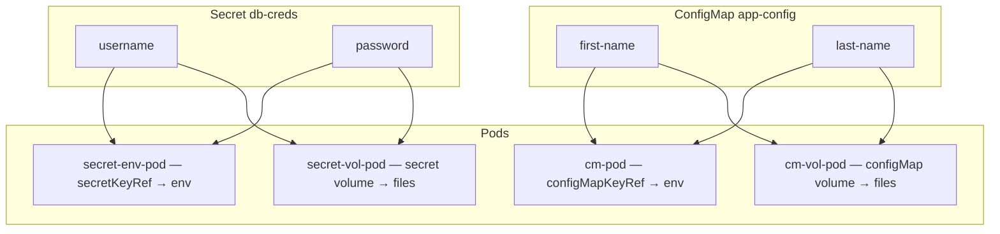

# Day 19 — ConfigMaps and Secrets

Decouple **configuration from container images** — same image, different env/config per cluster/namespace. High-yield for **CKA/CKAD** and platform interviews (GitOps, Vault, secret rotation).

---

## 1. Mental Model

```text
ConfigMap / Secret  →  inject into Pod  →  app reads env or files
        ↑
   not baked into image — portable across dev/stg/prd
```

**Interview one-liner:** ConfigMaps for config; Secrets for credentials — same injection patterns, different sensitivity handling.

---

## 2. ConfigMap vs Secret

| | ConfigMap | Secret |
|---|-----------|--------|
| **Data** | Non-sensitive plain text | Passwords, tokens, keys |
| **API storage** | Plain text in etcd* | **base64** in manifest/API (not encryption) |
| **Injection** | env, envFrom, volume, command | Same patterns |
| **CKA** | **Heavy** | **Heavy** — know `kubectl create secret` |

\* etcd encryption at rest is a separate cluster config (CKS territory).

**CrowdStrike / SRE angle:** Role mentions **Vault + automated secret rotation**. K8s Secrets are a delivery mechanism; Vault/External Secrets Operator holds truth in production.

---

## 3. Four Ways to Consume a ConfigMap

| # | Method | CKA frequency |
|---|--------|---------------|
| 1 | **Environment variables** (`configMapKeyRef` / `envFrom`) | **Very high** — your lab |
| 2 | **Volume mount** (each key → file in directory) | **High** — nginx.conf pattern |
| 3 | **Command / args** (`$(VAR)` substitution in command) | Medium |
| 4 | **In-pod code** calling K8s API | Rare on exam |

---

## 4. Lab — Env Vars from ConfigMap

| File | Purpose |
|------|---------|
| `configmaps-ns.yaml` | Namespace `configmaps` |
| `app-cm.yaml` | ConfigMap `app-config` with `first-name`, `last-name` |
| `pod-cm.yaml` | nginx pod → `FIRST_NAME`, `LAST_NAME` env vars |

### Apply order

```bash
kc apply -f configmaps-ns.yaml
kc apply -f app-cm.yaml
kc apply -f pod-cm.yaml
kc get cm,pod -n configmaps
```

### Verify inside pod

```bash
kc exec -it cm-pod -n configmaps -- printenv | grep -E 'FIRST|LAST'
kc exec -it cm-pod -n configmaps -- bash -c 'echo $FIRST_NAME $LAST_NAME'
# → harshal thaware
```

### YAML pattern (this lab)

```yaml
env:
- name: FIRST_NAME
  valueFrom:
    configMapKeyRef:
      name: app-config
      key: first-name
```

### All keys at once — `envFrom`

```yaml
envFrom:
- configMapRef:
    name: app-config
# Creates env vars: first-name=harshal, last-name=thaware (keys as names)
```

Use `configMapKeyRef` when you control env var names; use `envFrom` for bulk import.

---

## 5. Lab — Secrets (env + volume) — *added; instructor skipped*

Same namespace, same injection patterns — **different kind** and **secretKeyRef**.



| File | Purpose |
|------|---------|
| `app-secret.yaml` | Secret `db-creds` — `stringData` (plain in YAML, base64 in API) |
| `pod-secret-env.yaml` | `DB_USER`, `DB_PASSWORD` via **secretKeyRef** |
| `pod-secret-volume.yaml` | Mount at `/etc/db-creds/` — **preferred in prod** (not in `ps aux`) |
| `pod-cm-volume.yaml` | ConfigMap volume mount for comparison |

### Apply order

```bash
kc apply -f configmaps-ns.yaml
kc apply -f app-cm.yaml
kc apply -f app-secret.yaml
kc apply -f pod-cm.yaml
kc apply -f pod-secret-env.yaml
kc apply -f pod-secret-volume.yaml
kc apply -f pod-cm-volume.yaml
kc get cm,secret,pod -n configmaps
```

### Verify Secret — env injection

```bash
kc exec -it secret-env-pod -n configmaps -- printenv | grep DB_
# DB_USER=admin
# DB_PASSWORD=s3cr3t

kc get secret db-creds -n configmaps -o jsonpath='{.data.password}' | base64 -d && echo
# s3cr3t
```

### Verify Secret — volume mount (interview favorite)

```bash
kc exec -it secret-vol-pod -n configmaps -- ls /etc/db-creds
# username  password

kc exec -it secret-vol-pod -n configmaps -- cat /etc/db-creds/username
# admin
```

### ConfigMap vs Secret — side-by-side YAML

| ConfigMap | Secret |
|-----------|--------|
| `configMapKeyRef` | `secretKeyRef` |
| `configMapRef` (envFrom) | `secretRef` (envFrom) |
| `volumes.configMap` | `volumes.secret` |

```yaml
# Secret env — only change from ConfigMap lab
env:
- name: DB_PASSWORD
  valueFrom:
    secretKeyRef:
      name: db-creds
      key: password
```

### Interview: env vs file for secrets

| | Env (`secretKeyRef`) | Volume mount |
|---|------------------------|--------------|
| **Ease** | Simple | Slightly more YAML |
| **Visibility** | Shows in `printenv`, `/proc` | File with `defaultMode: 0400` |
| **Rotation** | Needs pod restart | Kubelet may sync file (~60s) |
| **Production** | OK for small apps | **Preferred** for DB passwords, TLS keys |

**CrowdStrike / Vault:** Vault holds truth → External Secrets Operator syncs → K8s Secret → volume mount into pod.

---

## 6. Volume Mount Pattern (exam favorite)

Each ConfigMap **key becomes a filename** under the mount path:

```yaml
volumes:
- name: config-vol
  configMap:
    name: app-config
containers:
- name: app
  volumeMounts:
  - name: config-vol
    mountPath: /etc/config
    readOnly: true
# → /etc/config/first-name  /etc/config/last-name
```

Optional: `items` to rename keys or pick subset.

See **`pod-cm-volume.yaml`** and **`pod-secret-volume.yaml`** for working labs.

---

## 7. Imperative Creation (CKA speed)

```bash
# Literal key=value
kc create configmap app-config -n configmaps \
  --from-literal=first-name=harshal --from-literal=last-name=thaware \
  --dry-run=client -o yaml > app-cm.yaml

# From file (filename becomes key unless --from-file=key=path)
kc create configmap nginx-config -n configmaps \
  --from-file=nginx.conf --dry-run=client -o yaml

# Secret — generic (base64 values in YAML output)
kc create secret generic db-creds -n configmaps \
  --from-literal=password=s3cr3t \
  --dry-run=client -o yaml

# Decode secret value (troubleshooting)
kc get secret db-creds -n configmaps -o jsonpath='{.data.password}' | base64 -d
```

---

## 8. Updates — What Propagates When?

| Consumption | ConfigMap/Secret updated | Pod sees new value? |
|-------------|--------------------------|---------------------|
| **env / envFrom** | Yes | **No** — env set at pod start → **restart pod** |
| **Volume mount** | Yes | **Yes** — kubelet syncs (default ~60s; `sync` subPath differs) |

**Exam trap:** "Updated ConfigMap but app still shows old value" → check if env-based; rollout restart Deployment or delete Pod.

```bash
kc rollout restart deployment/myapp -n configmaps   # if Deployment
kc delete pod cm-pod -n configmaps && kc apply -f pod-cm.yaml
```

---

## 9. Secrets — Declarative YAML (`app-secret.yaml`)

```yaml
apiVersion: v1
kind: Secret
metadata:
  name: db-creds
  namespace: configmaps
type: Opaque
stringData:              # plain in manifest — API stores base64 in .data
  username: admin
  password: s3cr3t
# Or data: with pre-encoded base64 (exam may give you encoded values)
```

**Security note:** base64 ≠ encryption. Use RBAC, encryption at rest, External Secrets / Vault for production. **Never commit real prod secrets to git** — this lab uses fake creds for learning.

---

## 10. ECS Parallel

| K8s | ECS |
|-----|-----|
| ConfigMap | Task definition **environment** / SSM params (non-secret) |
| Secret | Secrets Manager / SSM secure params → task **secrets** |
| envFrom | Bulk env from parameter store |
| Volume mount | EFS/config file sidecar pattern |

---

## 11. CKA Exam Tips

```bash
kc explain pod.spec.containers.env.valueFrom.configMapKeyRef
kc explain pod.spec.containers.env.valueFrom.secretKeyRef
kc explain pod.spec.volumes.configMap
kc explain pod.spec.volumes.secret
```

- ConfigMap must exist **before** pod references it (or pod stays pending/error)
- `configMapKeyRef.name` and `.key` must match exactly
- **`optional: true`** on keyRef — missing key won't block pod start
- Secrets: `secretKeyRef` instead of `configMapKeyRef`
- Always `-n <namespace>` when object is namespaced

---

## 12. Interview Q&A

| Question | Answer |
|----------|--------|
| ConfigMap vs Secret? | Same injection; Secrets for sensitive data + base64 in API; neither replaces Vault |
| secretKeyRef vs configMapKeyRef? | Identical YAML shape — swap kind source |
| Env vs volume for passwords? | **Volume preferred** — not exposed in process env / `kubectl describe pod` as plainly |
| Updated CM/Secret, env unchanged? | Env frozen at container start — restart required |
| Updated Secret, file unchanged? | Wait for kubelet sync (~60s) or restart; check mount path |
| Why not bake config in image? | Same image across envs; GitOps manages CM/Secret separately |
| How does CrowdStrike stack handle secrets? | Vault + GitOps rotation; K8s Secret as delivery layer into pods |
| Is base64 encryption? | **No** — encoding only; anyone with Secret read RBAC can decode |

---

## Reference

- [Configure a Pod to Use a ConfigMap](https://kubernetes.io/docs/tasks/configure-pod-container/configure-pod-configmap/)
- [Distribute Credentials Securely Using Secrets](https://kubernetes.io/docs/tasks/inject-data-application/distribute-credentials-secure/)
