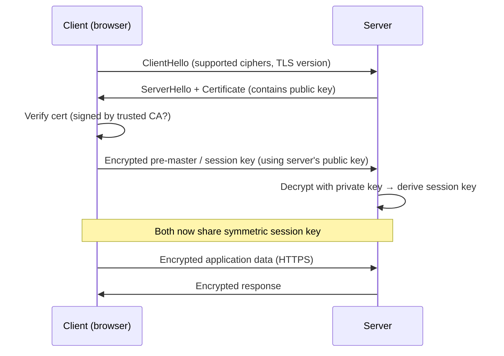
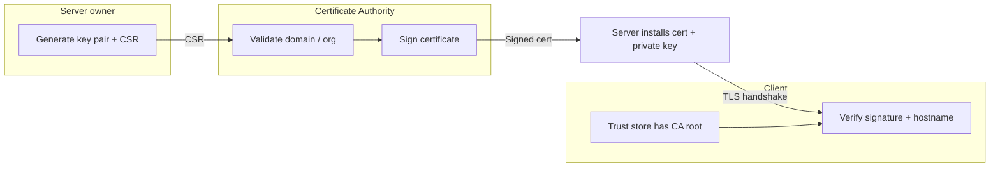

# Day 20 — SSL/TLS Fundamentals

Why **HTTPS** exists and how **certificates** establish trust — foundation for K8s **Ingress TLS**, **Secrets**, and platform interview questions.

---

## 1. Mental Model

```text
HTTP  →  plain text on the wire  →  anyone on the path can read credentials
HTTPS →  TLS encrypts the channel  →  ciphertext in transit; server identity verified by cert
```

**Interview one-liner:** TLS gives you **confidentiality** (encryption) + **authentication** (who is the server?) via certificates signed by a trusted CA.

---

## 2. HTTP vs HTTPS

| | HTTP | HTTPS (HTTP over TLS) |
|---|------|------------------------|
| **Port** | 80 | 443 |
| **Payload** | Plain text | Encrypted |
| **Risk** | Sniffing, MITM, credential theft | Mitigated when TLS configured correctly |
| **K8s touchpoint** | ClusterIP/NodePort without TLS | Ingress with `tls:` + Secret, or service mesh mTLS |

---

## 3. Encryption Types

### Symmetric (one shared key)

```text
Client ──[same key K]──► encrypt/decrypt ◄──[same key K]── Server
```

| Pros | Cons |
|------|------|
| Fast | Key must be shared securely — if intercepted, game over |

Used **inside** an established TLS session for bulk data (the session key).

### Asymmetric (key pair)

```text
Public key  → encrypt (anyone can have it)
Private key → decrypt (server only)
```

| Pros | Cons |
|------|------|
| Solves key exchange problem | Slower — not used for all traffic |

Foundation of **SSH**, **TLS/SSL**, and K8s **certificate signing** (apiserver, kubelet, etc.).

---

## 4. TLS Handshake (How HTTPS Works)

High-level flow — what happens before the first encrypted HTTP request:



### Steps in plain language

1. **Client** connects and asks for a secure session.
2. **Server** sends its **certificate** (includes **public key** + identity/domain).
3. **Client** checks the cert is signed by a **trusted CA** and matches the hostname.
4. Client generates a **symmetric session key**, encrypts it with the server's **public key**, sends it.
5. **Server** decrypts with its **private key** — only the server could read it.
6. Both use the **session key** for fast symmetric encryption of all further traffic.

**Why hybrid?** Asymmetric for safe key exchange; symmetric for speed on large payloads.

---

## 5. Certificates and Certificate Authorities (CA)



| Term | Meaning |
|------|---------|
| **CSR** (Certificate Signing Request) | "Please sign a cert for my domain" — contains public key + subject info |
| **CA** (Certificate Authority) | Trusted third party (DigiCert, Let's Encrypt) or **internal/custom CA** |
| **Signed certificate** | CA vouches: this public key belongs to this domain/org |
| **Trust store** | Browser/OS bundle of root CAs — if signer not trusted → browser warning |

### Public CA vs Custom (internal) CA

| | Public CA (Let's Encrypt, etc.) | Custom / private CA |
|---|--------------------------------|---------------------|
| **Use** | Internet-facing apps | Internal services, dev clusters, corporate mesh |
| **Trust** | Browsers trust by default | Must install root CA on clients/pods |
| **K8s** | cert-manager + HTTP-01/DNS-01 | cert-manager + internal CA, or manual Secret |

---

## 6. Where This Shows Up in Kubernetes (CKA preview)

You don't terminate TLS on every Pod — common patterns:

```text
Internet → Ingress (TLS) → Service → Pod (often plain HTTP inside cluster)
                ↑
         Secret type kubernetes.io/tls
         data: tls.crt, tls.key
```

| K8s object | TLS role |
|------------|----------|
| **Secret** (`tls.crt`, `tls.key`) | Store cert + private key for Ingress / webhook |
| **Ingress** `spec.tls` | Reference Secret; terminate HTTPS at ingress controller |
| **Service mesh** (Istio/Linkerd) | **mTLS** between pods — automatic sidecar certs |
| **apiserver** | Cluster components use their own PKI |

Example Ingress TLS snippet (exam awareness):

```yaml
spec:
  tls:
  - hosts:
    - app.example.com
    secretName: app-tls-secret
  rules:
  - host: app.example.com
    http:
      paths:
      - path: /
        pathType: Prefix
        backend:
          service:
            name: app-svc
            port:
              number: 80
```

Create TLS secret imperatively (CKA pattern):

```bash
kc create secret tls app-tls-secret \
  --cert=path/to/tls.crt --key=path/to/tls.key \
  -n default --dry-run=client -o yaml
```

---

## 7. ECS / Platform Parallel

| Concept | AWS ECS / ALB | Kubernetes |
|---------|---------------|------------|
| TLS termination | **ALB/NLB** listener + ACM cert | **Ingress** + TLS Secret (or cloud LB) |
| Cert provisioning | ACM auto-renew | cert-manager, Let's Encrypt |
| Internal mTLS | App Mesh / sidecar | Istio/Linkerd service mesh |
| Secrets storage | Secrets Manager → task | K8s Secret (base64) + Vault in prod |

**CrowdStrike stack note:** Role mentions **Vault** for secret lifecycle — TLS private keys and API tokens often originate in Vault, sync into K8s Secrets via operators.

---

## 8. Interview Q&A

| Question | Answer |
|----------|--------|
| Symmetric vs asymmetric? | Symmetric = one shared key, fast; asymmetric = public/private pair, solves key exchange |
| Why not asymmetric for all traffic? | Too slow at scale — TLS uses asymmetric once, then symmetric session key |
| What does a CA do? | Signs certs after validating identity — clients trust certs chained to known roots |
| What is a CSR? | Request to CA containing public key and domain/org details |
| HTTP inside K8s cluster — OK? | Common: TLS at edge (Ingress/LB); mesh adds mTLS between services in zero-trust setups |
| base64 Secret vs TLS? | Secret encoding ≠ encryption; protect private keys with RBAC + etcd encryption + Vault |

---

## 9. CKA Exam Tips

- TLS certs live in **Secrets** — keys `tls.crt` and `tls.key` (or `ca.crt` for CA bundles)
- Know `kubectl create secret tls` and wiring `secretName` in Ingress
- **Hostname must match** cert SAN/CN or clients reject the connection
- Troubleshooting: `kubectl describe ingress`, check Secret exists in same namespace as Ingress
- This day is **conceptual** — hands-on Ingress TLS labs typically follow in networking days

---

## Reference

- [TLS in Kubernetes Ingress](https://kubernetes.io/docs/concepts/services-networking/ingress/#tls)
- [Secrets — TLS type](https://kubernetes.io/docs/concepts/configuration/secret/#tls-secrets)
- [Let's Encrypt / cert-manager](https://cert-manager.io/docs/) (production automation)
