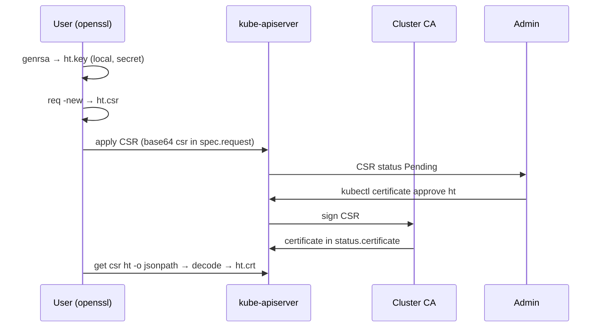

# Day 21 — Kubernetes CSR: Issue Client Certificates

Issue **client certificates** via the `certificates.k8s.io` API — same OpenSSL workflow as bare-metal sysadmin days, with K8s as the CA desk. Builds on **Day 20 TLS fundamentals**.

---

## 1. Mental Model — Bare Metal → Kubernetes

```text
Dell/HP RHEL box (7–10 yrs ago)          Kubernetes CKA lab
─────────────────────────────          ────────────────────
openssl genrsa → .key                  openssl genrsa → ht.key  (KEEP PRIVATE)
openssl req -new → .csr                openssl req -new → ht.csr
send CSR to CA admin                   kubectl apply CertificateSigningRequest
CA signs → .crt                        kubectl certificate approve ht
install in app / apache                decode status.certificate → ht.crt → kubeconfig
```

**Interview one-liner:** OpenSSL generates the key pair; Kubernetes CSR API is the ticket queue; cluster CA signs on `kubectl certificate approve`.

---

## 2. Certificate Types in a Cluster

| Type | Used by | Example signer |
|------|---------|----------------|
| **Client cert** | `kubectl`, controllers authenticating **to** apiserver | `kubernetes.io/kube-apiserver-client` |
| **Server cert** | etcd, kubelet, apiserver **endpoints** | `kubernetes.io/kubelet-serving`, etc. |
| **Root / CA cert** | Signs others; trust anchor | `/etc/kubernetes/pki/ca.crt` on control plane |

### File naming (sysadmin rule still applies)

| Extension | Contents | Commit to git? |
|-----------|----------|----------------|
| `.key` | **Private key** | **NEVER** |
| `.csr` | Certificate signing request (public) | Optional / gitignore locally |
| `.crt` / `.pem` | Signed certificate (public) | OK for lab certs |

---

## 3. CSR Workflow Diagram



---

## 4. Hands-on Lab

| File | Purpose |
|------|---------|
| `cert-ns.yaml` | Namespace `cert-management` (optional; CSR is cluster-scoped) |
| `csr.yaml` | `CertificateSigningRequest` for CN=ht |
| `ht.key`, `ht.csr` | Generated locally — **gitignored** |

**Official reference:** [Issue a Certificate for a Client](https://kubernetes.io/docs/tasks/tls/certificate-issue-client-csr/)

### Step 1 — Generate key + CSR (OpenSSL — same as bare metal)

```bash
cd Kubernetes/Day-21

openssl genrsa -out ht.key 2048
openssl req -new -key ht.key -out ht.csr -subj "/CN=ht"

# Embed CSR in YAML (paste into csr.yaml spec.request):
cat ht.csr | base64 | tr -d '\n' && echo
```

### Step 2 — Apply CSR object

```bash
kc apply -f cert-ns.yaml          # optional
kc apply -f csr.yaml
kc get csr
```

```
NAME   SIGNERNAME                            CONDITION
ht     kubernetes.io/kube-apiserver-client   Pending
```

**Trap:** `CertificateSigningRequest` is **cluster-scoped** — no `-n` namespace; `metadata.namespace` is ignored.

### Step 3 — Approve (admin role)

```bash
kc certificate approve ht
kc get csr ht
```

```
NAME   CONDITION
ht     Approved,Issued
```

### Step 4 — Retrieve signed certificate

```bash
kc get csr ht -o jsonpath='{.status.certificate}' | base64 -d > ht.crt
openssl x509 -in ht.crt -text -noout | head -20
```

Use `ht.crt` + `ht.key` in a kubeconfig `client-certificate` / `client-key` pair for client auth.

---

## 5. csr.yaml Key Fields (CKA)

```yaml
apiVersion: certificates.k8s.io/v1
kind: CertificateSigningRequest
metadata:
  name: ht                    # cluster-scoped — no namespace
spec:
  request: <base64-encoded PEM CSR>
  signerName: kubernetes.io/kube-apiserver-client
  expirationSeconds: 86400    # 24h in this lab
  usages:
  - client auth
```

| Field | Meaning |
|-------|---------|
| `spec.request` | **Base64** of PEM CSR (`cat ht.csr \| base64 \| tr -d '\n'`) |
| `signerName` | Which CA / policy signs it — must match allowed signers |
| `expirationSeconds` | Cert lifetime (optional; signer may cap) |
| `usages` | `client auth` for kubectl-style client certs |

---

## 6. Admin Commands (CKA speed)

```bash
kc get csr
kc describe csr ht
kc certificate approve ht
kc certificate deny ht          # if rejecting
kc delete csr ht

# Extract cert
kc get csr ht -o jsonpath='{.status.certificate}' | base64 -d > ht.crt

kc explain certificatesigningrequest.spec
```

---

## 7. Day 20 vs Day 21

| Day 20 | Day 21 |
|--------|--------|
| Why TLS (handshake, CA trust) | **How to issue** a client cert inside K8s |
| Ingress TLS Secret | CSR API for **user/component** client auth |
| Public CA / Let's Encrypt | **Cluster CA** signs CSR on approve |

---

## 8. Renewal

| Context | Renewal approach |
|---------|------------------|
| **This lab** | `expirationSeconds: 86400` → re-run CSR flow after 24h |
| **Bare metal** | Regenerate CSR before expiry, CA re-signs |
| **Production** | cert-manager, Vault, automated rotation — not manual CSR |

Client cert expired → generate new key/CSR → new CSR object → approve → update kubeconfig.

### Cert mismatch trap (Day 23/24 re-run)

Regenerated `ht.key` but kept old `ht.crt`:

```text
tls: private key does not match public key
```

Always overwrite `ht.crt` from approved CSR; verify pair:

```bash
openssl x509 -noout -modulus -in ht.crt | openssl md5
openssl rsa -noout -modulus -in ht.key | openssl md5
```

Full re-issue steps in **Day 23 notes §4**.

---

## 9. CKA Exam Tips

- Know **base64 encode** CSR for `spec.request` and **decode** `status.certificate`
- CSR is **cluster-scoped** — `kubectl get csr` (no namespace)
- Approve: `kubectl certificate approve <name>`
- Private key never leaves the requester; only CSR goes to API
- `signerName` + `usages` must be valid for the signer or CSR stays pending/denied

---

## 10. Interview Q&A

| Question | Answer |
|----------|--------|
| CSR vs Secret TLS? | CSR API issues **client** certs for auth; TLS Secrets store **server** cert+key for Ingress |
| Same as OpenSSL on Linux? | Yes — genrsa, req -new; K8s adds API object + approve step |
| Where is private key? | Stays with user (`ht.key`); never in CSR object |
| Is base64 encryption? | No — encoding only |
| Who signs? | Cluster CA after admin `certificate approve` |
| cert-manager vs CSR API? | cert-manager automates ACME/internal CA; CSR API is manual user cert issuance (CKA) |

---

## Reference

- [Issue a Certificate for a Client Using a CertificateSigningRequest](https://kubernetes.io/docs/tasks/tls/certificate-issue-client-csr/)
- [CertificateSigningRequest](https://kubernetes.io/docs/reference/kubernetes-api/authentication-resources/certificate-signing-request-v1/)
