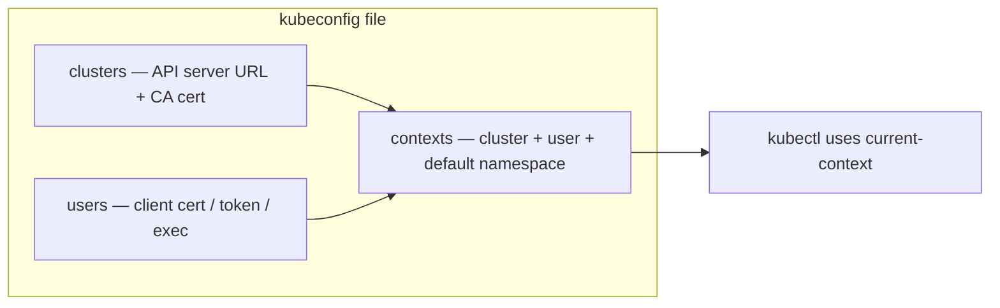
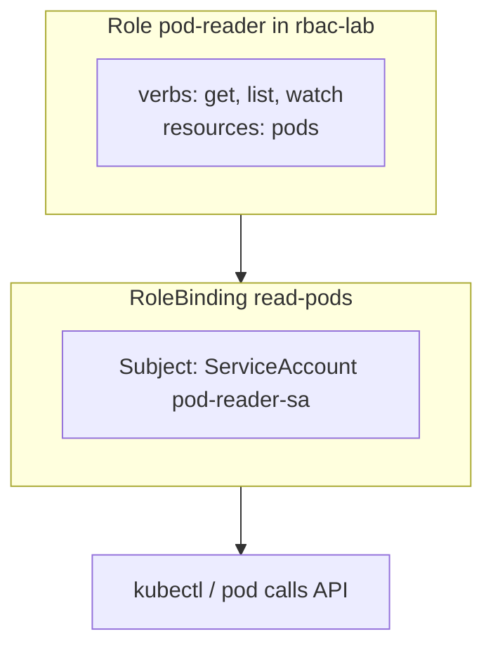

# Day 22 — Authentication, Authorization, and Kubeconfig

How **who you are** (auth) and **what you can do** (authz) work in Kubernetes — maps cleanly to **ECS + IAM**. Core **CKA** and platform interview material.

---

## 1. Mental Model — Two Steps at the API Server

```text
kubectl / controller / kubelet
        │
        ▼
   kube-apiserver
        │
        ├─ 1. AUTHENTICATION — Who are you?
        │      client cert, bearer token, SA token, OIDC, webhook
        │
        └─ 2. AUTHORIZATION — Are you allowed?
               RBAC (default prod), Node, Webhook (OPA), ABAC (legacy)
```

**Interview one-liner:** Authentication identifies the caller; authorization evaluates policy **after** identity is established.

---

## 2. ECS / IAM Parallel (your background)

| ECS / AWS | Kubernetes |
|-----------|------------|
| **IAM user / role** | User, Group, **ServiceAccount** |
| **IAM policy** (actions on resources) | **Role / ClusterRole** `rules` |
| **Attach policy to principal** | **RoleBinding / ClusterRoleBinding** |
| **Task role** (pod runtime identity) | **ServiceAccount** on Pod spec |
| **aws sts get-caller-identity** | `kubectl auth can-i ...` |
| **Least privilege** | Narrow verbs + resource names |

You already know RBAC logic — K8s just uses YAML objects instead of IAM JSON.

---

## 3. Kubeconfig — How kubectl Authenticates

**Default path:** `~/.kube/config`  
**Override:** `--kubeconfig /path/to/file` or `KUBECONFIG=/path/to/file`

### Three sections + contexts



| Section | Holds |
|---------|--------|
| **clusters** | `server:` URL, `certificate-authority-data` |
| **users** | Client cert/key, token, or `exec` (e.g. aws eks get-token) |
| **contexts** | Named link: `cluster` + `user` + optional `namespace` |

```bash
kc config get-contexts
kc config use-context my-cluster
kc config set-context --current --namespace=rbac-lab

# Multiple clusters — merge files
export KUBECONFIG=~/.kube/config:~/.kube/config-prod
```

**Multi-cluster guide:** [Configure access to multiple clusters](https://kubernetes.io/docs/tasks/access-application-cluster/configure-access-multiple-clusters/)

---

## 4. Authentication Methods (awareness)

| Method | Typical use |
|--------|-------------|
| **Client certificates** | kubeadm clusters, CSR flow (Day 21) |
| **Bearer tokens** | ServiceAccount tokens, static tokens (legacy) |
| **OIDC** | Enterprise SSO (Okta, Azure AD) |
| **Webhook token** | External auth service |
| **ServiceAccount** | In-cluster pods calling API |

Human `kubectl` → kubeconfig user creds.  
Pod → mounted SA token at `/var/run/secrets/kubernetes.io/serviceaccount/token`.

---

## 5. Authorization Modes

Configured on apiserver: `--authorization-mode=Node,RBAC` (order matters — first match wins).

| Mode | Purpose | CKA / prod |
|------|---------|------------|
| **RBAC** | Role-based policies via API objects | **Default standard** |
| **Node** | kubelet can only access its node's objects | Always with RBAC |
| **Webhook** | External decision (OPA Gatekeeper, etc.) | Enterprise |
| **ABAC** | Static policy file on apiserver | **Legacy — avoid** |
| **AlwaysAllow** | Allow everything | **Never in prod** (default if unset) |

**Trap:** No `--authorization-mode` → `AlwaysAllow` — wide open.

---

## 6. RBAC Object Model

```text
Role / ClusterRole          = WHAT is allowed (rules)
RoleBinding / ClusterRoleBinding = WHO gets it (subjects)

Namespace-scoped:  Role  + RoleBinding     →  one namespace
Cluster-scoped:    ClusterRole + ClusterRoleBinding → all namespaces (or bound to one ns)
```



| Object | Scope | Binds |
|--------|-------|-------|
| **Role** | Namespace | verbs on resources in that ns |
| **ClusterRole** | Cluster | nodes, PVs, all namespaces, CRDs |
| **RoleBinding** | Namespace | User / Group / SA → Role or ClusterRole |
| **ClusterRoleBinding** | Cluster | User / Group / SA → ClusterRole |

Built-in ClusterRoles: `view`, `edit`, `admin`, `cluster-admin` — know for exam.

---

## 7. Hands-on Lab — Role + RoleBinding

| File | Purpose |
|------|---------|
| `rbac-ns.yaml` | Namespace `rbac-lab` |
| `sa-pod-reader.yaml` | ServiceAccount identity |
| `role-pod-reader.yaml` | Allow get/list/watch pods |
| `rolebinding-pod-reader.yaml` | Bind SA → Role |

### Apply

```bash
kc apply -f rbac-ns.yaml
kc apply -f sa-pod-reader.yaml
kc apply -f role-pod-reader.yaml
kc apply -f rolebinding-pod-reader.yaml
```

### Verify authorization (CKA command)

```bash
# Allowed
kc auth can-i list pods \
  --as=system:serviceaccount:rbac-lab:pod-reader-sa -n rbac-lab
# yes

# Not allowed (delete not in Role)
kc auth can-i delete pods \
  --as=system:serviceaccount:rbac-lab:pod-reader-sa -n rbac-lab
# no

# Your admin user (for comparison)
kc auth can-i delete pods -n rbac-lab
# yes (if cluster-admin)
```

**ServiceAccount subject format:** `system:serviceaccount:<namespace>:<sa-name>`

---

## 8. RBAC vs ABAC

| | RBAC | ABAC |
|---|------|------|
| **Basis** | Role / binding objects | Attribute rules in static file |
| **Change policy** | `kubectl apply` — live | API server **restart** (legacy) |
| **K8s today** | **Standard** | Deprecated / rare |
| **Ops fit** | GitOps-friendly | Hard to scale |

RBAC is role-centric; ABAC is attribute-centric (time, IP, labels) — powerful but operationally heavy. Kubernetes chose RBAC as the mainstream path.

---

## 9. Cluster PKI (ties to Day 20–21)

Control plane certs live under **`/etc/kubernetes/pki/`** on control plane nodes:

| File (typical) | Role |
|----------------|------|
| `ca.crt` / `ca.key` | Cluster CA — signs client + server certs |
| `apiserver.crt` | API server TLS |
| Client certs in kubeconfig | Human/component auth to apiserver |

Internal mTLS between apiserver ↔ etcd ↔ kubelet uses this PKI. Day 21 CSR flow issues **client** certs signed by this CA.

---

## 10. CKA Exam Tips

```bash
# Generate Role / Binding quickly
kc create role pod-reader --verb=get,list,watch --resource=pods \
  -n rbac-lab --dry-run=client -o yaml

kc create rolebinding read-pods --role=pod-reader \
  --serviceaccount=rbac-lab:pod-reader-sa \
  -n rbac-lab --dry-run=client -o yaml

kc auth can-i create deployments --as=jane -n default
kc describe rolebinding read-pods -n rbac-lab
```

- **4 RBAC objects** — spell `apiGroup: rbac.authorization.k8s.io`
- **roleRef** is immutable — delete/recreate binding to change role
- **ClusterRoleBinding** for cluster-admin; **RoleBinding** for namespace-scoped
- Check **subjects** namespace matches SA namespace

---

## 11. Interview Q&A

| Question | Answer |
|----------|--------|
| Auth vs authz? | Auth = identity; authz = permission check (RBAC) |
| IAM equivalent? | Role = policy rules; RoleBinding = attach to user/SA |
| Task role in ECS? | **ServiceAccount** on Pod — token mounted automatically |
| How to debug "Forbidden"? | `kubectl auth can-i --as=<subject> -n <ns>` |
| RBAC vs ABAC in K8s? | RBAC via API objects; ABAC legacy, restart to change |
| Default if no authz mode? | **AlwaysAllow** — security risk |
| Who uses Node authorization? | **Kubelet** — limited to its own node resources |
| Secrets access? | Explicit rule: `resources: ["secrets"]` — not included in `view` for all secret types |

**Platform stack:** RBAC + network policies + Vault + mesh — layered; RBAC is the Kubernetes-native identity authorization layer.

---

## Reference

- [Using RBAC Authorization](https://kubernetes.io/docs/reference/access-authn-authz/rbac/)
- [Configure access to multiple clusters](https://kubernetes.io/docs/tasks/access-application-cluster/configure-access-multiple-clusters/)
- [Authenticating](https://kubernetes.io/docs/reference/access-authn-authz/authentication/)
