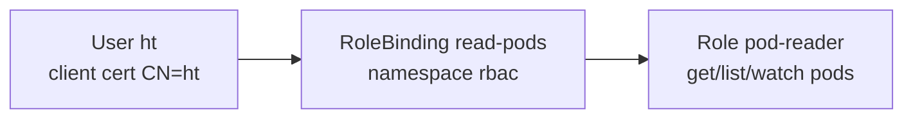

# Day 23 — RBAC Hands-on: User Cert + Role + RoleBinding

**Day 22** = auth/authz concepts. **Day 23** = practical loop: user `ht` (Day 21 CSR) → **Role** → **RoleBinding** → switch context → see **Forbidden** vs allowed.

**Day 24** covers ClusterRole and ClusterRoleBinding — not in this day's scope.

---

## 1. Mental Model (Day 23 only)

```text
Day 21                    Day 23
────────                  ──────
ht.key + ht.crt    →      User "ht" in kubeconfig (CN=ht)
                          Role pod-reader (rules in namespace rbac)
                          RoleBinding read-pods (User ht → Role)
                          use-context ht → API checks RBAC
```



| Object | What it does |
|--------|--------------|
| **Role** | Defines **what** is allowed — verbs on resources **in one namespace** |
| **RoleBinding** | Links **who** (User/Group/SA) to a Role **in that namespace** |

**Interview one-liner:** Role = policy; RoleBinding = attach policy to a user in a namespace.

---

## 2. Authentication vs Authorization (this lab)

| Step | Day 23 example |
|------|----------------|
| **Authentication** | `ht.crt` + `ht.key` — API knows `User "ht"` |
| **Authorization** | RoleBinding in `rbac` — can list pods **there only** |

**Authenticated but Forbidden** = valid cert, no permission for that verb/namespace.

Your session:

```bash
kc get po              # Forbidden — binding is not in default
kc get po -n rbac      # Allowed — empty list still success
kc run pod-ht ...      # Forbidden — no create verb
```

---

## 3. ECS / IAM Parallel

| K8s (Day 23) | ECS / IAM |
|--------------|-----------|
| User `ht` (cert CN) | IAM user |
| Role `pod-reader` | IAM policy (actions on resources) |
| RoleBinding `read-pods` | Attach policy to user |
| `Forbidden` | `AccessDenied` |
| `-n rbac` scope | Policy scoped to one environment/namespace |

---

## 4. Day 21 Revision — Cert Expired

Lab CSR used `expirationSeconds: 86400` (24h). Cert expired → **re-run Day 21** (formal renewal in later videos):

```bash
cd Kubernetes/Day-21
openssl genrsa -out ht.key 2048
openssl req -new -key ht.key -out ht.csr -subj "/CN=ht"
# update csr.yaml spec.request: cat ht.csr | base64 | tr -d '\n'
kc delete csr ht --ignore-not-found
kc apply -f csr.yaml
kc certificate approve ht
kc get csr ht -o jsonpath='{.status.certificate}' | base64 -d > ht.crt

kc config set-credentials ht \
  --client-certificate=ht.crt --client-key=ht.key
kc config set-context ht --cluster=kind-cka-cluster01 --user=ht
```

**RBAC subject name must match cert CN:** `RoleBinding` subject `name: ht` ↔ CSR `-subj "/CN=ht"`.

---

## 5. Hands-on Manifests

| File | Purpose |
|------|---------|
| `rbac-ns.yaml` | Namespace `rbac` |
| `read-role.yaml` | Role `pod-reader` — get, list, watch pods |
| `rolebinding.yaml` | User `ht` → Role in namespace `rbac` |

### Apply (admin context only)

```bash
kc config use-context kind-cka-cluster01
cd Kubernetes/Day-23
kc apply -f rbac-ns.yaml
kc apply -f read-role.yaml
kc apply -f rolebinding.yaml
```

**Trap:** User `ht` cannot `kubectl apply` — switch to admin first.

### Imperative (CKA speed)

```bash
kc create role pod-reader --verb=get,list,watch --resource=pods \
  -n rbac --dry-run=client -o yaml

kc create rolebinding read-pods --role=pod-reader --user=ht \
  -n rbac --dry-run=client -o yaml
```

---

## 6. Verify

### auth can-i (stay on admin context)

```bash
kc auth can-i list pods --as=ht -n rbac      # yes
kc auth can-i list pods --as=ht -n default   # no
kc auth can-i create pods --as=ht -n rbac    # no
```

### Switch context — feel RBAC

```bash
kc config use-context ht
kc get po -n rbac
kc get po                    # Forbidden
kc config use-context kind-cka-cluster01   # back to admin
```

---

## 7. Role + RoleBinding YAML

```yaml
# Role — namespace rbac
rules:
- apiGroups: [""]
  resources: ["pods"]
  verbs: ["get", "list", "watch"]

# RoleBinding — who gets the role
subjects:
- kind: User
  name: ht
roleRef:
  kind: Role
  name: pod-reader
```

RoleBinding **does not contain** rules — it references a Role by name. Both objects live in the **same namespace** (`rbac`).

---

## 8. kubectl config traps (from your lab)

| Wrong | Right |
|-------|-------|
| `kc get contexts` | `kc config get-contexts` |
| `kc config use-contexts ht` | `kc config use-context ht` |
| `kc config set-contexts ht` | `kc config set-context ht` |

---

## 9. CKA Exam Tips (Day 23 scope)

- Role + RoleBinding are **namespace-scoped** — `-n` matters on both
- Subject `User` name = client cert **CN**
- Test with `kubectl auth can-i --as=ht -n rbac`
- `roleRef` is **immutable** — delete and recreate binding to change role
- RoleBinding references a **Role** in the same namespace (ClusterRole → Day 24)

---

## 10. Interview Q&A (Day 23 scope)

| Question | Answer |
|----------|--------|
| Role vs RoleBinding? | Role = permissions; RoleBinding = who gets them |
| Authenticated but Forbidden? | Valid cert; missing binding or wrong namespace/verb |
| How is User ht identified? | Client cert CN matches RoleBinding subject |
| Why Forbidden in default ns? | RoleBinding exists only in `rbac` namespace |
| Cert expired? | Re-issue via Day 21 CSR flow; RBAC objects unchanged |

---

## Reference

- [Using RBAC Authorization](https://kubernetes.io/docs/reference/access-authn-authz/rbac/)
- [kubectl create role](https://kubernetes.io/docs/reference/kubectl/generated/kubectl_create/kubectl_create_role/)
- [kubectl create rolebinding](https://kubernetes.io/docs/reference/kubectl/generated/kubectl_create/kubectl_create_rolebinding/)
- [Issue client cert (Day 21)](https://kubernetes.io/docs/tasks/tls/certificate-issue-client-csr/)
