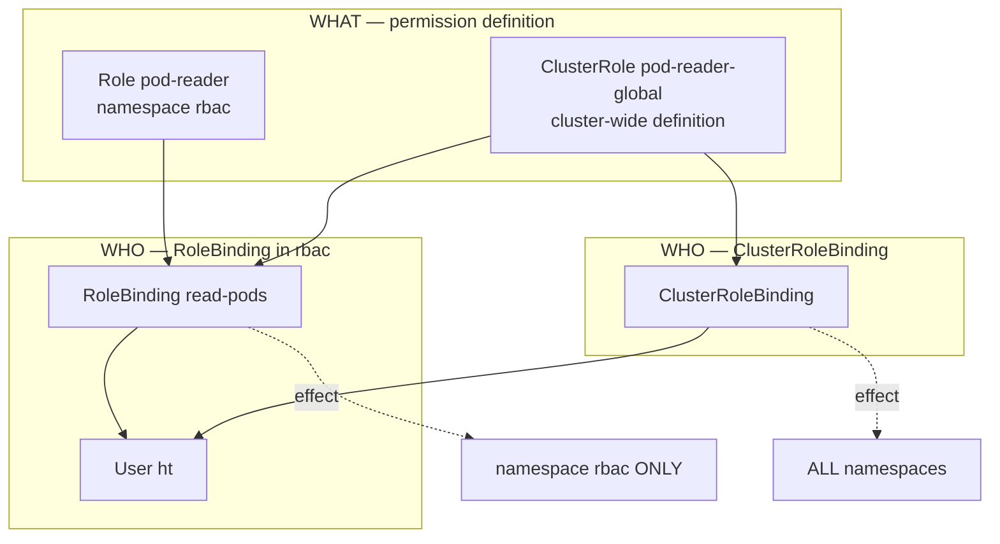

# Day 23 — RBAC Hands-on: User Certs + Role + RoleBinding

**Day 22** = concepts. **Day 23** = end-to-end: create user `ht` (Day 21 CSR), bind permissions, **switch context**, feel Forbidden vs allowed.

The hard part is **four objects** — this day focuses on **Role + RoleBinding + User**. ClusterRole/ClusterRoleBinding explained for CKA completeness.

---

## 1. The Four Objects — One Table (memorize this)

```text
WHAT (rules)              WHO + WHERE (binding)
────────────────          ─────────────────────
Role          ──┐
                ├── RoleBinding        →  ONE namespace only
ClusterRole   ──┘

ClusterRole   ─── ClusterRoleBinding   →  ENTIRE cluster
```

| Object | Defines rules? | Scope of binding |
|--------|----------------|------------------|
| **Role** | Yes | N/A (needs RoleBinding) |
| **ClusterRole** | Yes | N/A (needs Binding) |
| **RoleBinding** | No — links subject → role | **Single namespace** |
| **ClusterRoleBinding** | No — links subject → role | **All namespaces + cluster resources** |

### The trap that confused everyone

**RoleBinding can reference a ClusterRole** — but permissions still apply **only in the RoleBinding's namespace**.

```yaml
# ClusterRole defined once cluster-wide
kind: ClusterRole
metadata:
  name: pod-reader-global

# Reuse in namespace rbac — ht can read pods IN rbac ONLY
kind: RoleBinding
metadata:
  namespace: rbac
roleRef:
  kind: ClusterRole          # ← ClusterRole name
  name: pod-reader-global
subjects:
- kind: User
  name: ht
```

Same ClusterRole + **ClusterRoleBinding** → ht reads pods **everywhere**.



**Interview one-liner:** Role vs ClusterRole = where rules are **defined**; RoleBinding vs ClusterRoleBinding = where rules **apply**.

---

## 2. ECS / IAM Parallel

| K8s | IAM equivalent |
|-----|----------------|
| Role (namespace) | Policy scoped to one account partition / resource path |
| ClusterRole | Policy usable cluster-wide |
| RoleBinding | Attach policy to user **in one account/OU** |
| ClusterRoleBinding | Attach policy org-wide |
| User `ht` (cert CN) | IAM user |
| `Forbidden` from API | `AccessDenied` |

---

## 3. End-to-End Lab Flow

```text
Day 21 (re-run if cert expired)
  openssl genrsa → ht.key
  openssl req → ht.csr → CSR approve → ht.crt
  kubeconfig: user ht + context ht

Day 23
  Role pod-reader (get/list/watch pods in rbac)
  RoleBinding read-pods (User ht → Role)
  kubectl use-context ht → test
```

### Step 0 — Day 21 revision (cert expired)

Lab cert had `expirationSeconds: 86400` (24h). When expired, **re-run Day 21** (instructor covers formal renewal later):

```bash
cd Kubernetes/Day-21
openssl genrsa -out ht.key 2048
openssl req -new -key ht.key -out ht.csr -subj "/CN=ht"
# update csr.yaml spec.request with: cat ht.csr | base64 | tr -d '\n'
kc delete csr ht --ignore-not-found
kc apply -f csr.yaml
kc certificate approve ht
kc get csr ht -o jsonpath='{.status.certificate}' | base64 -d > ht.crt

# Wire kubeconfig (if not already)
kc config set-credentials ht \
  --client-certificate=ht.crt --client-key=ht.key
kc config set-context ht --cluster=kind-cka-cluster01 --user=ht
```

**User identity for RBAC:** certificate **Common Name (CN=ht)** → API sees `User "ht"`.

**Renewal (preview — later videos):** new CSR before expiry, or cert-manager / short-lived certs in production.

---

## 4. Hands-on — Day 23 Manifests

| File | Purpose |
|------|---------|
| `rbac-ns.yaml` | Namespace `rbac` |
| `read-role.yaml` | Role `pod-reader` — get/list/watch pods |
| `rolebinding.yaml` | User `ht` → Role in namespace `rbac` |

### Apply (as admin context)

```bash
kc config use-context kind-cka-cluster01   # admin
cd Kubernetes/Day-23
kc apply -f rbac-ns.yaml
kc apply -f read-role.yaml
kc apply -f rolebinding.yaml
```

### Imperative equivalents (CKA speed)

```bash
kc create role pod-reader --verb=get,list,watch --resource=pods \
  -n rbac --dry-run=client -o yaml

kc create rolebinding read-pods --role=pod-reader --user=ht \
  -n rbac --dry-run=client -o yaml
```

---

## 5. Verify — The Payoff

### As admin (before switching)

```bash
kc auth can-i list pods --as=ht -n rbac      # yes
kc auth can-i list pods --as=ht -n default   # no
kc auth can-i create pods --as=ht -n rbac      # no
```

### Switch to user ht

```bash
kc config use-context ht
kc get po -n rbac          # OK — empty list is success
kc get po                  # Forbidden in default
kc run pod-ht --image=nginx # Forbidden — no create verb
```

### Switch back to admin

```bash
kc config use-context kind-cka-cluster01
```

---

## 6. Your Session — What Happened

| Command | Result | Why |
|---------|--------|-----|
| `use-context ht` | Switched | Now API sees User ht |
| `get po` (default) | **Forbidden** | RoleBinding is in `rbac`, not default |
| `get po -n rbac` | Empty list | **Allowed** — get/list/watch works |
| `run pod-ht` (default) | **Forbidden** | No create verb + wrong namespace |

**Authenticated but not authorized** = valid cert, no RoleBinding for that action/namespace.

---

## 7. kubectl config traps (from your output)

| Wrong | Right |
|-------|-------|
| `kc get contexts` | `kc config get-contexts` |
| `kc config use-contexts ht` | `kc config use-context ht` |
| `kc config set-contexts ht` | `kc config set-context ht` |

---

## 8. Built-in ClusterRoles (awareness)

| ClusterRole | Rough meaning |
|-------------|---------------|
| `view` | Read most namespaced objects |
| `edit` | view + write (no RBAC/roles) |
| `admin` | edit + RoleBindings in ns |
| `cluster-admin` | Everything |

```bash
kc get clusterrole view -o yaml | head -30
```

---

## 9. CKA Exam Tips

- **4 objects**, 2 scopes — draw the table before answering
- RoleBinding → Role **or** ClusterRole (namespace-limited either way)
- ClusterRoleBinding → ClusterRole only (cluster-wide)
- Subject types: `User`, `Group`, `ServiceAccount`
- User name = cert CN for client cert auth
- `kubectl auth can-i --as=<user> -n <ns>`
- `roleRef` is **immutable** — delete binding to change role

---

## 10. Interview Q&A

| Question | Answer |
|----------|--------|
| Role vs ClusterRole? | Both define rules; ClusterRole is cluster-scoped definition (nodes, PVs, all ns) |
| RoleBinding + ClusterRole? | Reuses cluster role definition; effect **still one namespace** |
| RoleBinding vs ClusterRoleBinding? | Namespace vs cluster-wide effect |
| Authenticated but Forbidden? | Cert valid; missing/wrong RBAC binding |
| How is User ht identified? | Client cert CN matches RoleBinding subject name |
| Cert expired? | Re-issue CSR or automate rotation — RBAC unchanged |

---

## Reference

- [Using RBAC Authorization](https://kubernetes.io/docs/reference/access-authn-authz/rbac/)
- [kubectl create role](https://kubernetes.io/docs/reference/kubectl/generated/kubectl_create/kubectl_create_role/)
- [kubectl create rolebinding](https://kubernetes.io/docs/reference/kubectl/generated/kubectl_create/kubectl_create_rolebinding/)
- [Issue client cert (Day 21)](https://kubernetes.io/docs/tasks/tls/certificate-issue-client-csr/)
