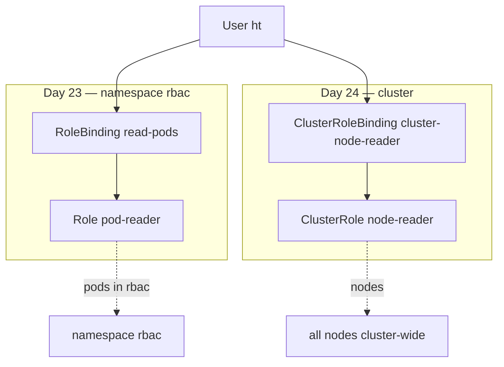

# Day 24 — ClusterRole + ClusterRoleBinding

**Day 23** = Role + RoleBinding (namespace `rbac`, pods only). **Day 24** = **cluster-wide** RBAC for resources like **nodes** — user `ht` continues from Day 21 cert.

---

## 1. Day 23 vs Day 24

```text
Day 23                          Day 24
──────                          ──────
Role (namespace rbac)           ClusterRole (cluster-wide)
RoleBinding → User ht           ClusterRoleBinding → User ht
get/list/watch pods in rbac     get/list/watch nodes everywhere
kc get po -n rbac ✓             kc get nodes ✓
kc get po (default) ✗           kc delete node ✗ (no delete verb)
```

| | Role + RoleBinding | ClusterRole + ClusterRoleBinding |
|---|-------------------|----------------------------------|
| **Scope** | One namespace | Entire cluster |
| **Typical resources** | pods, deploys, svc | **nodes**, PVs, namespaces, CRDs |
| **kubectl** | `-n` required for get/describe Role | **no `-n`** for ClusterRole |

**Interview one-liner:** Namespaced RBAC for apps; ClusterRole for infrastructure/cluster objects.

---

## 2. Four Objects — Full Picture (Days 23 + 24)

```text
WHAT (rules)              WHO + WHERE (binding)
────────────────          ─────────────────────
Role          ──┐
                ├── RoleBinding        →  ONE namespace
ClusterRole   ──┤
                └── ClusterRoleBinding →  ENTIRE cluster
```



**Bonus (Day 24+ awareness):** RoleBinding can reference a **ClusterRole** but effect stays in **one namespace** — not used in this lab.

---

## 3. Cluster-Scoped Trap — No Namespace

ClusterRole and ClusterRoleBinding are **cluster-scoped**:

```bash
kc describe clusterrole node-reader          # correct
kc describe clusterrolebinding cluster-node-reader

# -n is ignored (doesn't error, but misleading habit)
kc describe clusterrole node-reader -n rbac  # still works — ns ignored
```

**YAML trap:** `metadata.namespace: rbac` on ClusterRole/ClusterRoleBinding is **ignored** — remove it from manifests (internet copies often include it wrongly).

Compare to Day 23:

```bash
kc describe role pod-reader -n rbac          # -n REQUIRED
```

---

## 4. Hands-on Lab

| File | Purpose |
|------|---------|
| `node-reader-role.yaml` | ClusterRole — get/list/watch **nodes** |
| `cluster-node-reader-binding.yaml` | User `ht` → ClusterRole cluster-wide |

**Prerequisites:** Day 21 user `ht` (valid matching `ht.key` + `ht.crt`), Day 23 optional.

### Apply (admin context)

```bash
kc config use-context kind-cka-cluster01
cd Kubernetes/Day-24
kc apply -f node-reader-role.yaml
kc apply -f cluster-node-reader-binding.yaml
```

### Imperative (CKA speed)

```bash
kc create clusterrole node-reader --verb=get,list,watch --resource=nodes \
  --dry-run=client -o yaml

kc create clusterrolebinding cluster-node-reader \
  --clusterrole=node-reader --user=ht \
  --dry-run=client -o yaml
```

---

## 5. Verify

### auth can-i (admin context)

```bash
kc auth can-i list nodes --as=ht              # yes
kc auth can-i delete nodes --as=ht            # no
kc auth can-i list pods --as=ht -n default    # no (unless Day 23 binding still exists)
```

### As user ht

```bash
kc config use-context ht
kc get nodes                                  # ✓ all nodes
kc get pods                                   # Forbidden (default) — no pod Role in default
kc delete node cka-cluster01-worker           # Forbidden — read-only verbs
kc config use-context kind-cka-cluster01      # back to admin
```

### Inspect bindings

```bash
kc describe clusterrolebinding | grep -i node-reader
kc describe clusterrole node-reader
```

---

## 6. ECS / IAM Parallel

| Day 24 K8s | IAM equivalent |
|------------|----------------|
| ClusterRole | Org-wide / account-level policy for infrastructure APIs |
| ClusterRoleBinding | Attach that policy to user for **all** accounts/regions |
| nodes get/list/watch | Read-only EC2 DescribeInstances cluster-wide |
| no delete verb | No `ec2:TerminateInstances` |

---

## 7. Built-in ClusterRoles (awareness)

| ClusterRole | Meaning |
|-------------|---------|
| `view` | Read most namespaced objects |
| `edit` | view + write (no roles/bindings) |
| `admin` | edit + RoleBindings in ns |
| `cluster-admin` | **Everything** |

```bash
kc get clusterrole view -o yaml | head -20
```

---

## 8. CKA Exam Tips

- **ClusterRole** / **ClusterRoleBinding** — no namespace in metadata
- `roleRef.kind` must be **ClusterRole** in ClusterRoleBinding
- Cluster resources: `nodes`, `persistentvolumes`, `namespaces`, `storageclasses`
- Test: `kubectl auth can-i list nodes --as=ht`
- `kc get clusterrolebinding,clusterrole`

---

## 9. Interview Q&A

| Question | Answer |
|----------|--------|
| Role vs ClusterRole? | Namespace-scoped vs cluster-scoped **rules definition** |
| ClusterRoleBinding vs RoleBinding? | Cluster-wide vs single-namespace **effect** |
| Why `-n` not needed for ClusterRole? | Object is not namespaced |
| ht can get nodes but not delete? | verbs only get/list/watch — least privilege |
| RoleBinding + ClusterRole? | Reuses ClusterRole definition; effect still one ns (not this lab) |

---

## Reference

- [Using RBAC Authorization](https://kubernetes.io/docs/reference/access-authn-authz/rbac/)
- [kubectl create clusterrole](https://kubernetes.io/docs/reference/kubectl/generated/kubectl_create/kubectl_create_clusterrole/)
- [kubectl create clusterrolebinding](https://kubernetes.io/docs/reference/kubectl/generated/kubectl_create/kubectl_create_clusterrolebinding/)
