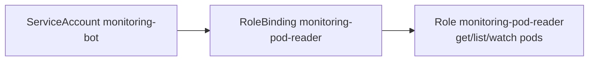

# Day 25 — ServiceAccount + RBAC

**Non-human identity** for apps, monitoring, CI/CD — **Role + RoleBinding** to a **ServiceAccount** (not User). Caps the Day 23–24 RBAC arc.

---

## 1. RBAC Arc — Days 23 → 25 (know by heart)

```text
Day 23   User ht          + RoleBinding → Role          → pods in rbac
Day 24   User ht          + ClusterRoleBinding → ClusterRole → nodes cluster-wide
Day 25   ServiceAccount   + RoleBinding → Role          → pods in deamon-monitoring
```

| Object | Question it answers |
|--------|---------------------|
| **Role / ClusterRole** | **WHAT** can be done? (verbs on resources) |
| **RoleBinding / ClusterRoleBinding** | **WHO** gets it? (User, Group, **ServiceAccount**) |
| **ServiceAccount** | In-cluster identity for pods and automation |



**Interview one-liner:** Humans use kubeconfig + client certs; workloads use **ServiceAccount** + mounted token.

---

## 2. Human User vs ServiceAccount

| | User (Day 23–24) | ServiceAccount (Day 25) |
|---|------------------|-------------------------|
| **Who** | Engineer, `ht` cert CN | Prometheus, Grafana agent, bot |
| **Auth** | kubeconfig client cert | SA token (mounted in pod) |
| **RBAC subject** | `kind: User`, `name: ht` | `kind: ServiceAccount`, `name: monitoring-bot` |
| **can-i format** | `--as=ht` | `--as=system:serviceaccount:deamon-monitoring:monitoring-bot` |
| **ECS parallel** | IAM user | **Task role** on task definition |

---

## 3. Hands-on Lab

| File | Purpose |
|------|---------|
| `deamon-monitoring-ns.yaml` | Namespace (course spelling) |
| `monitoring-bot.yaml` | ServiceAccount |
| `monitoring-bot-secrets.yaml` | Legacy SA token Secret (course demo) |
| `monitoring-role.yaml` | Role — get/list/watch pods |
| `monitoring-rolebinding.yaml` | SA → Role |
| `set-user.sh` | Optional — automate Day 21 client cert user |

### Apply order

```bash
kc config use-context kind-cka-cluster01
cd Kubernetes/Day-25
kc apply -f deamon-monitoring-ns.yaml
kc apply -f monitoring-bot.yaml
kc apply -f monitoring-bot-secrets.yaml
kc apply -f monitoring-role.yaml
kc apply -f monitoring-rolebinding.yaml
```

### Verify RoleBinding subject is ServiceAccount

```bash
kc describe rolebinding monitoring-pod-reader -n deamon-monitoring
```

```
Subjects:
  Kind            Name            Namespace
  ServiceAccount  monitoring-bot  deamon-monitoring
```

---

## 4. Verify Permissions

### auth can-i (correct SA subject format)

```bash
kc auth can-i list pods \
  --as=system:serviceaccount:deamon-monitoring:monitoring-bot \
  -n deamon-monitoring
# yes

kc auth can-i create pods \
  --as=system:serviceaccount:deamon-monitoring:monitoring-bot \
  -n deamon-monitoring
# no — Role has read-only verbs
```

### Trap — `--as monitoring-bot` is wrong

```bash
kc run monitor-pod --image=nginx -n deamon-monitoring --as monitoring-bot
# Forbidden: User "monitoring-bot" ...
```

`--as monitoring-bot` impersonates a **User**, not the ServiceAccount. The API sees `User "monitoring-bot"`, but RoleBinding grants **ServiceAccount** `monitoring-bot`.

**Correct impersonation:**

```bash
kc auth can-i list pods \
  --as=system:serviceaccount:deamon-monitoring:monitoring-bot \
  -n deamon-monitoring
```

**In production:** pod runs with `serviceAccountName: monitoring-bot` — kubelet mounts token automatically; app uses in-cluster config.

---

## 5. ServiceAccount Token

### Legacy Secret (this lab)

```yaml
type: kubernetes.io/service-account-token
metadata:
  annotations:
    kubernetes.io/service-account.name: monitoring-bot
```

Controller fills `token`, `ca.crt`, `namespace` in Secret data.

```bash
kc describe secret monitoring-bot-secret -n deamon-monitoring
```

### Modern K8s (awareness)

- Bound, expiring tokens via **projected volumes** (default for new clusters)
- Long-lived tokens require explicit Secret (like this lab) or TokenRequest API

---

## 6. Pod Using ServiceAccount (next step)

```yaml
spec:
  serviceAccountName: monitoring-bot
  # token auto-mounted at /var/run/secrets/kubernetes.io/serviceaccount/
```

Pod identity = SA → RBAC applies without `--as` from your laptop.

---

## 7. Image Pull Secrets (course mention)

Never hardcode registry creds. Link pull secret to SA or pod:

```yaml
# on ServiceAccount
imagePullSecrets:
- name: my-registry-secret
```

Same pattern as ECS private registry auth on task definition.

---

## 8. Four Objects — Final Cheat Sheet

| Binding | roleRef | Subject | Effect |
|---------|---------|---------|--------|
| RoleBinding | Role | User / Group / SA | one namespace |
| RoleBinding | ClusterRole | User / Group / SA | one namespace |
| ClusterRoleBinding | ClusterRole | User / Group / SA | entire cluster |

**Day 25 row:** RoleBinding + Role + **ServiceAccount** in `deamon-monitoring`.

---

## 9. CKA Exam Tips

```bash
kc create serviceaccount monitoring-bot -n deamon-monitoring --dry-run=client -o yaml

kc create rolebinding monitoring-pod-reader \
  --role=monitoring-pod-reader \
  --serviceaccount=deamon-monitoring:monitoring-bot \
  -n deamon-monitoring --dry-run=client -o yaml
```

- RoleBinding subject for SA: include **`namespace`** on subject
- can-i SA: `system:serviceaccount:<ns>:<sa-name>`
- Don't confuse SA name with User name in binding

---

## 10. Interview Q&A

| Question | Answer |
|----------|--------|
| User vs ServiceAccount? | Human vs workload identity; different RBAC subject kinds |
| ECS task role equivalent? | **ServiceAccount** on Pod spec |
| Why Forbidden with `--as monitoring-bot`? | Impersonating User; binding is for ServiceAccount |
| Default SA? | Every namespace has `default`; minimal permissions |
| Where is SA token? | Projected volume or legacy Secret; path under `/var/run/secrets/...` |

---

## Reference

- [Service Accounts](https://kubernetes.io/docs/concepts/security/service-accounts/)
- [Using RBAC with ServiceAccounts](https://kubernetes.io/docs/reference/access-authn-authz/rbac/#service-account-permissions)
