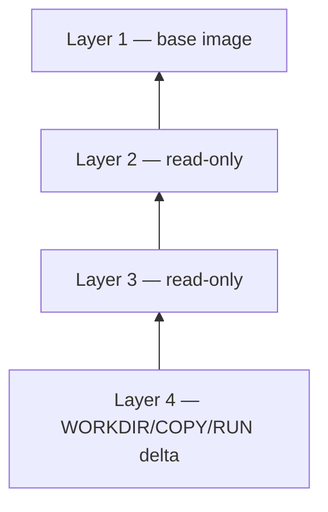
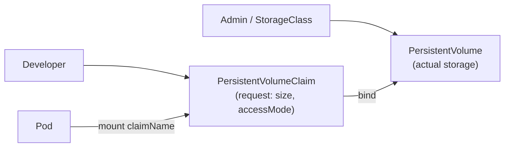

# Day 27 — Storage (Docker + Kubernetes)

**Quick read:** [quick-read.md](./quick-read.md) · Full notes below

Combined notes: **Part 1** Docker (Day 27 video) · **Part 2** K8s PV/PVC (Day 28 video)

---

# Part 1 — Docker (Layers, Volumes, Bind Mounts)

## 1. Mental Model

```text
Dockerfile instructions  →  read-only image layers (immutable)
Container start          →  + thin writable container layer (ephemeral)
Volume / bind mount      →  data on host, survives container delete
```

**Interview one-liner:** Image layers = immutable app filesystem; volumes = persistent data that outlives any one container instance.

---

## 2. Layered Image Architecture

Each Dockerfile instruction that changes the filesystem creates a **new read-only layer**:

```dockerfile
FROM ubuntu:22.04      # layer 1
RUN apt-get update     # layer 2
COPY app /app          # layer 3
WORKDIR /app           # layer 4 (metadata layer)
```



| Property | Why it matters |
|----------|----------------|
| **Read-only** | Same image = same bits everywhere (immutable infrastructure) |
| **Layer cache** | Unchanged steps reuse cache on rebuild — only changed layer + below rebuild |
| **Shared layers** | Many images sharing `FROM node:20` store base once on disk |

### Change one layer → cache invalidation

```text
Edit line 3 in Dockerfile
  → layer 3 recreated
  → layers 4, 5, 6… recreated
  → layers 1–2 still from cache
```

---

## 3. Container (Writable) Layer

When `docker run` starts a container, Docker adds a **thin writable layer** on top:

| | Image layers | Container layer |
|---|--------------|-----------------|
| **Writable?** | No | **Yes** |
| **Lifetime** | Permanent (in image) | **Deleted with container** |
| **Use** | App binaries, libs | Runtime writes, temp files |

**Copy-on-write (CoW):** modify a file from a read-only layer → Docker copies it into the writable layer first, then applies changes. Original image layer stays untouched.

**Why data is “lost” when container stops/deletes:** runtime changes live only in the container layer (unless mounted volume/bind).

---

## 4. Storage Driver vs Volume Driver

| | **Storage driver** | **Volume driver** |
|---|-------------------|-------------------|
| **Manages** | Image layers + container layer on disk | **Named volumes** (persistent data) |
| **Examples** | `overlay2` (modern Linux default) | `local` (default), cloud plugins |
| **Location** | `/var/lib/docker/overlay2/...` | `/var/lib/docker/volumes/<name>/_data` |
| **CKA/Docker focus** | Awareness | **Volumes for persistence** |

Docker picks storage driver based on OS (use `overlay2` on Linux; avoid legacy AUFS/devmapper).

---

## 5. Volumes vs Bind Mounts

| | **Docker volume** | **Bind mount** |
|---|-------------------|----------------|
| **Managed by** | Docker (volume driver) | You — explicit host path |
| **Path** | `/var/lib/docker/volumes/...` | Any host dir e.g. `/home/data` |
| **Portable** | Better — Docker abstracts path | Host-specific path |
| **Share between containers** | **Yes** — same volume name | Yes — same host path |
| **Typical use** | DB data, app persistence | Dev: live code mount, config from host |
| **K8s parallel (Part 2)** | PV + PVC | `hostPath` |

**Ownership (remember):** bind mount = **you** own the host path; volume = **Docker** owns (`/var/lib/docker/volumes/...`). **Both persist** after container delete.

### Commands (hands-on)

```bash
# Named volume — preferred for persistence
docker volume create app-data
docker volume ls
docker volume inspect app-data

docker run -d --name db -v app-data:/var/lib/mysql mysql:8

# Second container — same volume (share data)
docker run --rm -v app-data:/data busybox ls /data

# Bind mount — host path → container path
docker run -d -v /host/path/config:/etc/app/config:ro nginx

# Anonymous volume (removed with container unless --rm not used carefully)
docker run -v /data busybox
```

**`:ro`** = read-only mount (maps to K8s `readOnly: true`).

---

## 6. Can Containers Share the Same Volume?

**Yes** — mount the same named volume (or bind path) in multiple containers:

```bash
docker volume create shared-logs
docker run -d --name app -v shared-logs:/logs myapp
docker run -d --name sidecar -v shared-logs:/logs log-shipper
```

Same pattern as **sidecar** pods sharing a volume in Kubernetes (Part 2).

---

## 7. Choosing Storage (decision tree)

```text
Data must survive container delete?
  NO  → container writable layer OK (cache, temp)
  YES → volume or bind mount
        Prefer named volume (portable, Docker-managed)
        Bind mount when you need a fixed host path (dev/config)
```

---

## 8. ECS / Platform Parallel

| Docker | ECS / K8s (preview) |
|--------|---------------------|
| Image layers | Container image layers (same OCI model) |
| Writable layer | Ephemeral container filesystem |
| Named volume | EBS volume / EFS mount; **PV + PVC** |
| Bind mount | `hostPath`, task volume host source |
| `-v name:/path` | `volumeMounts` in pod spec (see **Part 2**) |

---

## 9. CKA / Interview Q&A (Docker storage)

| Question | Answer |
|----------|--------|
| Volumes vs bind mounts? | Volume = Docker-managed, portable; bind = explicit host path |
| Why layered images? | Cache, dedup, immutable deployments |
| Writable layer vs volume? | Writable = ephemeral; volume = persists past container |
| Data lost on `docker rm`? | Container layer gone; **volume data remains** |
| Share storage between containers? | Same `-v volume-name:/path` on both |
| Storage driver purpose? | How layer filesystem is stored on disk (`overlay2`) |

---

# Part 2 — Kubernetes (PV, PVC, StorageClass)

## Docker → K8s mapping (bridge from Part 1)

| Docker | Kubernetes |
|--------|------------|
| Named volume | **PersistentVolume** + **PersistentVolumeClaim** |
| Bind mount | **hostPath** (node-local; limited in prod) |
| Ephemeral container dir | **emptyDir** (dies with pod) |
| `-v name:/path` | `volumes` + `volumeMounts` in Pod spec |
| Config file mount | **ConfigMap / Secret** volume ([Day 19](../Day-19/day-19-notes.md)) |

---

## 1. Mental Model

```text
Pod spec:  volumes[]          →  define storage source (emptyDir, PVC, hostPath, …)
           volumeMounts[]     →  mount into container at mountPath

PVC (request)  →  bind  →  PV (actual storage pool)  →  Pod mounts PVC
```

**Interview one-liner:** Volumes decouple storage from containers; PV/PVC decouple **who provisions storage** (admin) from **who consumes it** (developer).

**Key lifetime rule:** `emptyDir` survives **container restart** but dies with the **Pod**. PV data survives Pod delete (policy-dependent).

---

## 2. Pod Volume Anatomy

Every volume mount needs **two** blocks in the Pod spec:

```yaml
spec:
  volumes:
  - name: data-vol              # logical name — referenced below
    persistentVolumeClaim:
      claimName: my-pvc
  containers:
  - name: app
    volumeMounts:
    - name: data-vol            # must match volumes[].name
      mountPath: /data
      readOnly: false           # Docker :ro → readOnly: true
```

| Field | Purpose |
|-------|---------|
| `volumes[]` | Declares **what** storage exists for this pod |
| `volumeMounts[]` | Declares **where** each container sees it |
| Same `name` in both | Links mount to volume definition |

Multiple containers in one Pod can mount the **same** volume (sidecar / log-shipper pattern — same as Docker shared volume).

---

## 3. Volume Types (CKA priority)

| Type | Lifetime | Typical use | CKA weight |
|------|----------|-------------|------------|
| **emptyDir** | Pod lifetime | scratch, cache, inter-container share | **High** |
| **PVC** | Independent of Pod | DB data, stateful apps | **Very high** |
| **hostPath** | Node filesystem | Single-node demos, node agents | Medium |
| **configMap / secret** | CM/Secret lifetime | Config files (Day 19) | High |
| **projected** | Combined sources | SA token + CM + Secret in one mount | Low |

---

## 4. emptyDir

Ephemeral directory on the **node** — created when Pod is scheduled, deleted when Pod is removed.

```yaml
spec:
  volumes:
  - name: cache
    emptyDir: {}
  containers:
  - name: redis
    image: redis:7
    volumeMounts:
    - name: cache
      mountPath: /data
```

| Survives | Does NOT survive |
|----------|------------------|
| Container crash / restart within same Pod | Pod delete |
| One container dying; sibling still running | Node reschedule to different node (data was on old node) |

**When to use:** temp files, sort buffers, sharing files between containers in the same Pod (app + sidecar).

**Optional:** `emptyDir.medium: Memory` → tmpfs (RAM disk, fast, lost on node reboot).

---

## 5. PersistentVolume (PV) vs PersistentVolumeClaim (PVC)



| | **PV** | **PVC** |
|---|--------|---------|
| **Who creates** | Admin, or **dynamic** via StorageClass | Developer / app team |
| **What it is** | Cluster storage **resource** (the pool) | **Request** for storage |
| **Scope** | Cluster-scoped | Namespace-scoped |
| **Binds to** | One matching PVC | One matching PV |

### PV example (static — admin pre-provisioned)

```yaml
apiVersion: v1
kind: PersistentVolume
metadata:
  name: pv-data-10g
spec:
  capacity:
    storage: 10Gi
  accessModes:
  - ReadWriteOnce
  volumeMode: Filesystem
  persistentVolumeReclaimPolicy: Retain
  storageClassName: manual          # must match PVC unless default SC exists
  hostPath:                         # demo only — not for multi-node prod
    path: /mnt/data
    type: DirectoryOrCreate
```

### PVC example

```yaml
apiVersion: v1
kind: PersistentVolumeClaim
metadata:
  name: app-data-claim
  namespace: default
spec:
  accessModes:
  - ReadWriteOnce
  resources:
    requests:
      storage: 5Gi
  storageClassName: manual
```

### Pod using PVC

```yaml
spec:
  volumes:
  - name: app-storage
    persistentVolumeClaim:
      claimName: app-data-claim
  containers:
  - name: mysql
    image: mysql:8
    volumeMounts:
    - name: app-storage
      mountPath: /var/lib/mysql
```

### Verify binding

```bash
kubectl get pv,pvc
kubectl describe pvc app-data-claim   # Events: "Successfully bound to volume pv-data-10g"
```

**Binding rules:** PVC requests `storage`, `accessModes`, and optionally `storageClassName`. Scheduler/controller finds a **matching unbound** PV. No match → PVC stays `Pending`.

---

## 6. Access Modes

| Mode | Abbrev | Meaning |
|------|--------|---------|
| **ReadWriteOnce** | RWO | One node can mount read-write |
| **ReadOnlyMany** | ROX | Many nodes read-only |
| **ReadWriteMany** | RWX | Many nodes read-write |

**CKA trap:** access mode on PV and PVC **must match** for binding. RWO is most common (EBS, local disk). RWX needs shared filesystem (EFS, NFS, CephFS).

**Interview:** "Can two Pods on different nodes share one RWO volume?" → **No** — RWO allows one node only (multiple pods on **same** node may share depending on driver).

---

## 7. hostPath

Maps a path on the **node** into the Pod — like Docker bind mount.

```yaml
volumes:
- name: node-data
  hostPath:
    path: /mnt/disks/ssd1
    type: DirectoryOrCreate
```

| Good for | Bad for |
|----------|---------|
| Single-node lab, DaemonSet node logs | Multi-node StatefulSets — Pod reschedule lands on different node, **data not there** |
| Node-level agents (CNI, monitoring) | Production DB persistence |

**Why not multi-node:** Pod bound to node A's `/mnt/data`; reschedule to node B → empty or missing path. Use PV/PVC + cloud disk or NFS instead.

---

## 8. Reclaim Policy

What happens to PV (and data) when PVC is deleted:

| Policy | Behavior | Typical source |
|--------|----------|----------------|
| **Retain** | PVC gone; PV → `Released`; data **kept**; admin must reclaim manually | Static PVs, prod data |
| **Delete** | PV + underlying volume **deleted** (cloud API) | Dynamic provisioning default on many clouds |
| **Recycle** | `rm -rf` on volume, PV available again | **Deprecated** — don't use |

```bash
kubectl delete pvc app-data-claim
kubectl get pv    # STATUS: Released (Retain) or gone (Delete)
```

**CKA:** know `persistentVolumeReclaimPolicy` on PV spec; dynamic volumes inherit from StorageClass.

---

## 9. Static vs Dynamic Provisioning

| | **Static** | **Dynamic** |
|---|------------|-------------|
| **PV creation** | Admin creates PV manually | **StorageClass** creates PV when PVC appears |
| **Workflow** | Create PV → Create PVC → bind | Create PVC (+ storageClassName) → PV auto-created |
| **Exam pattern** | `kubectl create pv`, hostPath demo | `storageClassName: gp2` on PVC |
| **Production** | Rare (legacy, special cases) | **Standard** — EBS, GCE PD, Azure Disk |

### Dynamic flow

```text
Developer creates PVC (storageClassName: fast-ssd, 20Gi)
  → provisioner sees unbound PVC
  → creates cloud disk + PV
  → binds PVC ↔ PV
  → Pod mounts PVC
```

No admin pre-creates PV — **StorageClass** is the abstraction over AWS/GCP/Azure/NFS.

---

## 10. StorageClass

Defines **how** volumes are provisioned dynamically.

```yaml
apiVersion: storage.k8s.io/v1
kind: StorageClass
metadata:
  name: fast-ssd
provisioner: kubernetes.io/aws-ebs    # cloud-specific; Kind uses local-path etc.
parameters:
  type: gp3
reclaimPolicy: Delete
volumeBindingMode: WaitForFirstConsumer   # delay bind until Pod scheduled (topology)
allowVolumeExpansion: true
```

PVC references it:

```yaml
spec:
  storageClassName: fast-ssd
  resources:
    requests:
      storage: 20Gi
```

```bash
kubectl get storageclass
kubectl describe storageclass fast-ssd
```

**Default StorageClass:** cluster may annotate one SC as default — PVCs without `storageClassName` use it.

---

## 11. Choosing Storage (decision tree)

```text
Data must survive Pod delete?
  NO  → emptyDir (or container filesystem)
  YES → PVC
        Multi-node app needs shared RW?
          YES → RWX + NFS/EFS/CephFS StorageClass
          NO  → RWO + cloud block storage (EBS, PD)
        Who creates the disk?
          Admin pre-made     → static PV + PVC
          Cloud auto         → StorageClass + PVC only
        Dev single-node demo → hostPath PV (exam/lab only)
```

---

## 12. CKA Imperative Commands

```bash
# PV (exam-style — know flags)
kubectl create pv pv1 --capacity=10Gi \
  --access-modes=ReadWriteOnce \
  --host-path=/mnt/data \
  --storage-class=manual

# PVC
kubectl create pvc myclaim --storage-class=manual \
  --access-modes=ReadWriteOnce --size=5Gi

# Debug
kubectl get pv,pvc,sc
kubectl describe pvc myclaim
kubectl describe pod <pod>    # Events: FailedMount, wrong SC, no matching PV
```

**Dry-run / YAML generation:**

```bash
kubectl create pv pv1 --capacity=10Gi --access-modes=ReadWriteOnce \
  --host-path=/mnt/data --storage-class=manual --dry-run=client -o yaml
```

---

## 13. ECS / Platform Parallel

| Kubernetes | ECS / AWS |
|------------|-----------|
| PVC | Task EBS volume claim / EFS mount in task def |
| PV | Actual EBS/EFS volume |
| StorageClass | EBS volume type + IOPS in task/service config |
| emptyDir | Ephemeral task storage |
| hostPath | EC2 host bind (EC2 launch type only — not Fargate) |
| RWO EBS | One task per volume attachment (similar constraint) |
| RWX EFS | Shared file storage across tasks/AZs |

**Dynatrace / observability angle:** stateful workloads (metrics DB, trace storage) depend on PVC + correct reclaim policy — accidental `Delete` on prod SC is a data-loss incident.

---

## 14. CKA / Interview Q&A (K8s storage)

| Question | Answer |
|----------|--------|
| PV vs PVC? | PV = storage resource; PVC = request that binds to matching PV |
| emptyDir vs PVC? | emptyDir dies with Pod; PVC persists beyond Pod |
| Static vs dynamic? | Static = admin creates PV first; dynamic = StorageClass creates PV on PVC |
| Why not hostPath in prod? | Pod reschedule → different node → data not portable |
| Access modes? | RWO (one node RW), ROX (many RO), RWX (many RW) |
| Reclaim Retain vs Delete? | Retain keeps data after PVC delete; Delete removes backing volume |
| PVC Pending? | No matching PV, wrong SC, or provisioner failure — `describe pvc` |
| Share volume between containers? | Same Pod, same volume name in volumeMounts (sidecar) |
| Config vs storage? | ConfigMap/Secret for config files; PVC for stateful data (Day 19) |

---

## 15. Common Exam Traps

1. **PVC `storageClassName` mismatch** — PVC wants `manual`, PV has `fast-ssd` → never binds.
2. **Capacity** — PVC request ≤ PV capacity; 15Gi claim won't bind to 10Gi PV.
3. **Access mode mismatch** — PV RWO, PVC RWX → no bind.
4. **Forgot `volumeMounts`** — volume defined but not mounted → app writes to ephemeral layer.
5. **hostPath on multi-node** — works until Pod moves nodes.
6. **Recycle policy** — obsolete; use Retain or Delete.

---

## 16. Lab Checklist (hands-on)

- [ ] Redis + `emptyDir` — write data, delete container, data remains; delete Pod, data gone
- [ ] Static PV + PVC + Pod (hostPath on Kind)
- [ ] `kubectl get pv,pvc` — verify `Bound`
- [ ] Delete PVC — observe reclaim policy behavior
- [ ] StorageClass + dynamic PVC (if cluster has default SC / local-path)

Manifests: add under `Day-27/` when labbed (`emptydir-redis.yaml`, `pv-pvc-pod.yaml`, `practice-output.md`).

---

## Reference

### Docker (Part 1)
- [Docker storage overview](https://docs.docker.com/storage/)
- [Volumes](https://docs.docker.com/storage/volumes/)
- [Bind mounts](https://docs.docker.com/storage/bind-mounts/)
- [Storage drivers (overlay2)](https://docs.docker.com/storage/storageserver/)

### Kubernetes (Part 2)
- [Volumes](https://kubernetes.io/docs/concepts/storage/volumes/)
- [Persistent Volumes](https://kubernetes.io/docs/concepts/storage/persistent-volumes/)
- [Storage Classes](https://kubernetes.io/docs/concepts/storage/storage-classes/)
