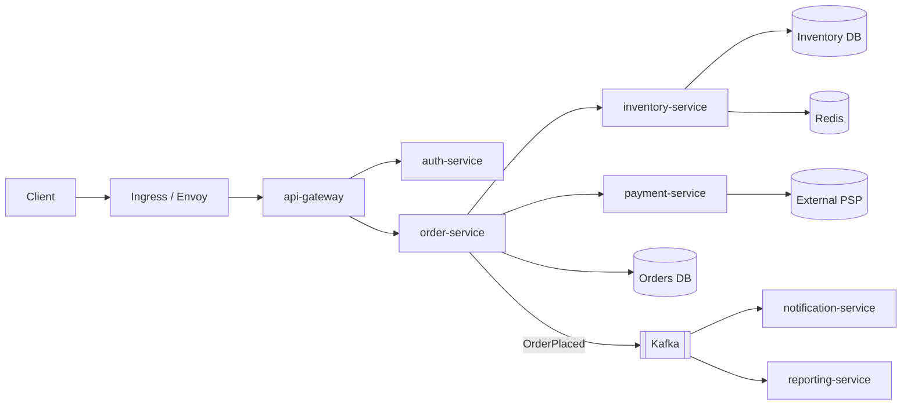
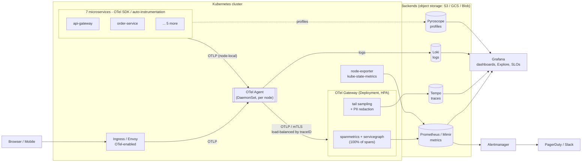
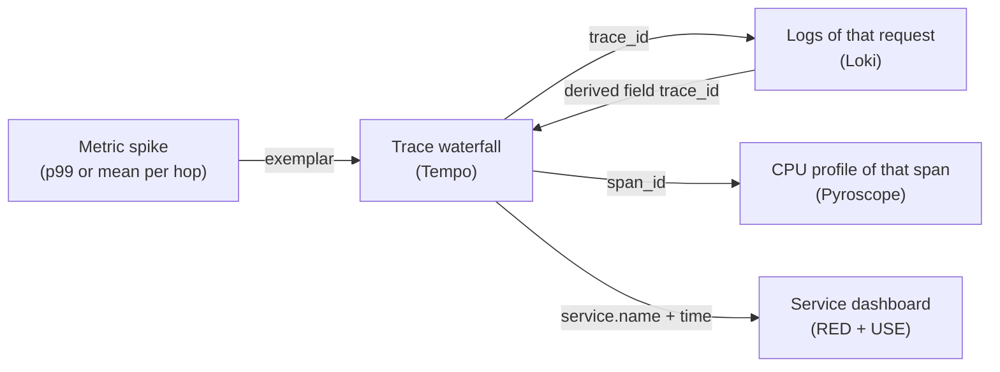
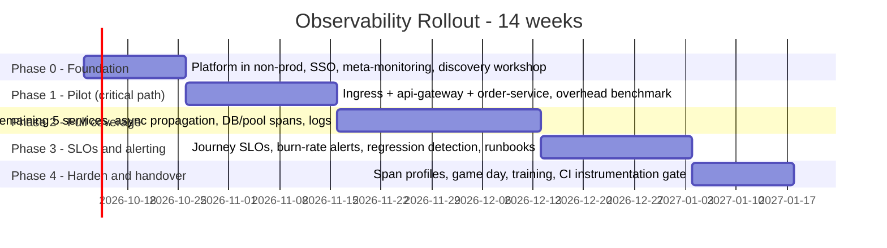

# RFC-001: End-to-End Observability with Millisecond-Precision Distributed Tracing

| Field | Value |
|---|---|
| **RFC ID** | RFC-001 |
| **Title** | End-to-End Observability for the Business Org Platform (7 microservices) |
| **Author** | Harshal Thaware, Sr. SRE |
| **Reviewers** | Service Architects (x7), Engineering Manager |
| **Status** | Draft - for review |
| **Created** | 2026-09-30 |
| **Decision needed by** | 2026-10-09 (to start Phase 0 on 2026-10-12) |

---

## 1. Executive Summary

**The problem.** When a customer request is slow today, we cannot say *which* of our 7 services, *which* dependency (database, cache, queue, third party), or *which* part of the work consumed the time. Investigations turn into cross-team log searches and "it's not us" discussions. Latency creeps in one deploy at a time and is noticed only when customers complain.

**The proposal.** Build an open-source observability platform where every request carries a single trace ID from the edge to the last database call, and every hop is timed with microsecond precision:

| Layer | Tool | What it answers |
|---|---|---|
| Instrumentation standard | **OpenTelemetry (OTel)** SDKs + Collector | One vendor-neutral way to emit traces, metrics, logs |
| Metrics | **Prometheus** (long-term storage via **Grafana Mimir**) | *Is* something wrong? How much, since when? |
| Traces | **Grafana Tempo** | *Where* in the request path is the time going? |
| Logs | **Grafana Loki** | *What* exactly happened in that request? |
| Profiles | **Grafana Pyroscope** | *Why* is this code slow (which function, which line)? |
| Visualization and alerting | **Grafana** + **Alertmanager** | One pane, one-click pivot metric → trace → log → profile |

**The outcome.**
1. Every request's lifecycle is broken down hop by hop, with timestamps at microsecond precision.
2. A **1 ms latency regression on any critical hop is detected and attributed to the correct hop** within 15 minutes at production traffic levels. We will prove this with a controlled latency-injection test before sign-off (Section 14).
3. 100% of requests feed the latency metrics. No request is left out because of sampling.
4. The code stays vendor-neutral. OTel instrumentation works unchanged with any backend if we later move to a managed or commercial offering.

**Timeline and investment.**
- **14 weeks** in 5 phases. The first visible value comes in **week 5** (a traced critical journey in production).
- **People:** 2 SREs (platform), plus about **3-5 engineer-days per service team** for instrumentation.
- **Infrastructure:** estimated at about **$3k-6k/month** for all environments. This is an order-of-magnitude figure that will be validated in Phase 0 (Section 11).

**Decisions requested from management** are listed in Section 18.

---

## 2. Context and Current State

> The current state below is based on typical patterns. It will be validated in the Phase 0 discovery workshop with the architects.

- **7 microservices** owned by different teams, with a mix of synchronous (HTTP/gRPC) and asynchronous (message broker) communication.
- Logs are per service and uncorrelated. There is no shared request identifier across services.
- Metrics exist for infrastructure (CPU, memory) but not consistently for request latency per operation.
- There is no distributed tracing, so end-to-end latency cannot be broken down by hop.
- Alerting is threshold-based on resources rather than on user-facing symptoms. This causes noise and missed incidents.

**Illustrative topology** (placeholder names; the real inventory goes in Appendix A):



---

## 3. Goals and Non-Goals

### Goals
- **G1 - Full request lifecycle visibility.** Every request is traceable from ingress to the last downstream call, including async hops over the message broker.
- **G2 - Millisecond attribution.** Any latency change of 1 ms or more on a critical hop is visible and attributable to that hop.
- **G3 - Correlation.** One click from a metric spike to example traces, from a trace to its logs, and from a span to its CPU profile.
- **G4 - SLO-driven alerting.** Page on user-impacting symptoms (burn-rate alerts), not on resource noise.
- **G5 - Low overhead.** Instrumentation must not add the milliseconds we are trying to measure (Section 10).
- **G6 - Self-service.** Service teams can build their own dashboards and queries without SRE involvement.
- **G7 - No lock-in.** Open standards (OTLP, W3C Trace Context, PromQL).

### Non-Goals (this RFC)
- Business analytics or BI reporting.
- Security monitoring (SIEM). This can consume the same OTel logs later.
- Replacing existing incident management tooling (PagerDuty and Slack remain).
- Real User Monitoring (browser/mobile) is optional in Phase 4 and not a success criterion.

---

## 4. Requirements

### Functional
| ID | Requirement |
|---|---|
| FR-1 | W3C `traceparent` propagated across all HTTP, gRPC, and messaging hops for all 7 services |
| FR-2 | Spans for every I/O boundary: inbound request, outbound HTTP/gRPC, DB query, cache call, message produce/consume, connection-pool acquire, retries |
| FR-3 | RED metrics (Rate, Errors, Duration) per service, per operation, derived from **100%** of spans |
| FR-4 | Service dependency graph generated automatically from traces |
| FR-5 | Every log line carries `trace_id` and `span_id` |
| FR-6 | Metrics link to example traces (exemplars) |
| FR-7 | SLOs per critical user journey with multi-window, multi-burn-rate alerts |
| FR-8 | Latency regression detection per hop, comparing against the pre-deploy and week-over-week baselines |
| FR-9 | Version-aware telemetry (`service.version`) to compare canary with stable |

### Non-Functional
| ID | Requirement | Target |
|---|---|---|
| NFR-1 | Instrumentation CPU overhead per service | ≤ 3% |
| NFR-2 | Added p99 request latency from instrumentation | ≤ 0.5 ms (measured) |
| NFR-3 | Telemetry pipeline must never block or fail the application | Non-blocking async export; bounded queues |
| NFR-4 | Ingest pipeline availability | 99.9% |
| NFR-5 | Trace completeness (no broken or orphan traces) | ≥ 99% |
| NFR-6 | Cross-host clock offset | ≤ 0.5 ms (alerted) |
| NFR-7 | Query latency for a trace by ID | < 2 s |
| NFR-8 | Retention | Traces 14 d, logs 30 d, metrics 13 months |
| NFR-9 | PII never stored in telemetry | Redaction enforced at the pipeline |

---

## 5. What "Seeing Every Millisecond" Actually Requires

This is the core engineering argument of the RFC. Tracing tools alone do not guarantee millisecond visibility. We need **four guarantees**, and each one has a specific design answer.

### 5.1 Guarantee 1 - No "dark time" in the request path

A millisecond cannot be seen if it happens outside any span. Here is the anatomy of a single service-to-service hop:

| Segment of the hop | Typical hidden cost | How we measure it |
|---|---|---|
| DNS, TCP connect, TLS handshake | 0.5-20 ms on cold connections | Client span with HTTP client instrumentation (connection events) |
| Wait for a pooled connection (HTTP / DB) | Unbounded under load | **Dedicated `pool.acquire` span** + pool metrics (e.g., HikariCP) |
| Network and proxy / sidecar transit | 0.2-5 ms | Client span duration **minus** server span duration |
| Server-side queueing (thread pool, event loop) | Grows under load | Server span starts at accept; runtime queue metrics |
| Handler business logic (CPU) | Variable | Server span **self-time**, explained by **continuous profiling** |
| DB / cache / downstream calls | Most common hotspot | Auto-instrumented client spans with `db.*` / `rpc.*` attributes |
| Retries | Silent 2-3x multiplier | **Each retry attempt is its own span** (`http.request.resend_count`) |
| Serialization / payload size | 0.1-10 ms for large payloads | Manual span around (de)serialization on hot paths |
| GC / runtime pauses | 1-100 ms stalls | Runtime metrics (GC pause histogram), correlated by time |
| Async queue time (produce → consume) | ms to minutes | Producer/consumer spans + `app.messaging.queue_time_ms` attribute + consumer lag |

**Design principle: spans for waits, profiles for CPU.** We put spans around every wait (I/O, pools, queues, retries). We do not create spans around every function, because that adds overhead and noise. When time is spent on CPU inside a span, **Pyroscope span profiles** show the exact functions responsible for that span's self-time.

### 5.2 Guarantee 2 - Accurate timing

- OTel spans carry **nanosecond-resolution timestamps**. Span *durations* are measured within a single process using the monotonic clock, so they are accurate to microseconds regardless of NTP.
- *Cross-host* comparisons (the client-minus-server "network gap") depend on clock sync. We will run **chrony** against the cloud provider's time sync service (typically tens of microseconds of offset). We will alert when `node_timex_offset_seconds` exceeds 0.5 ms, which keeps skew well below the 1 ms resolution we need.

### 5.3 Guarantee 3 - Sampling must not hide the millisecond

Storing 100% of traces is expensive and unnecessary. Dropping traces before computing metrics, however, would bias every latency number. So we split the two concerns:

- **All spans (100%)** flow through the OTel Gateway, which computes **span metrics** (latency histograms per service and operation) and the **service graph** *before* any sampling. Every single request contributes to the latency numbers.
- **Tail-based sampling** then decides which *full traces* to store. We keep 100% of error traces, 100% of slow traces (per-journey thresholds), 100% of canary-version traces during rollouts, and about 10% of the rest as a baseline (Section 7.3).
- **Exemplars** link each metric data point to a real stored trace ID, so every spike on a graph has a clickable example.

### 5.4 Guarantee 4 - Enough resolution in the aggregates

The default OTel histogram buckets (0, 5, 10, 25, 50, 75, 100 ms ...) **cannot show a 1 ms change**. A shift from 12 ms to 13 ms stays in the same bucket. We fix this with two mechanisms:

1. **Exponential (native) histograms.** OTel exponential histograms map to Prometheus native histograms. The bucket resolution adapts per series, giving about 1-5% relative error with only populated buckets stored. For a hop running at 10-30 ms, a 1 ms percentile shift is resolved directly.
2. **Exact means.** Every histogram also carries an exact `sum` and `count`, so **mean latency is exact**, independent of buckets. We use means for regression detection and percentiles for SLOs.

**Is a 1 ms shift statistically detectable?** The standard error of a mean is σ/√n:

| Hop traffic | Latency std-dev (σ) | Window | Samples (n) | Standard error | 1 ms shift = |
|---|---|---|---|---|---|
| 200 rps | 15 ms | 5 min | 60,000 | 0.06 ms | **~16 SE (unambiguous)** |
| 20 rps | 15 ms | 15 min | 18,000 | 0.11 ms | ~9 SE (clear) |
| 2 rps | 15 ms | 15 min | 1,800 | 0.35 ms | ~3 SE (needs a 1 h window) |

**Takeaway for management:** at production traffic, a 1 ms regression on a busy hop is a strong, unambiguous signal within minutes. For low-traffic endpoints, the detection window automatically widens. We are explicit about this rather than over-promising.

### 5.5 What this does *and does not* mean

| We WILL | We will NOT |
|---|---|
| Time every hop of every request at µs precision | Page an engineer for every 1 ms fluctuation |
| Detect and attribute any sustained ≥ 1 ms regression on critical hops | Store 100% of raw traces indefinitely (cost without value) |
| Keep every error and slow trace | Promise 1 ms detection on endpoints receiving a handful of requests per hour in a 5-minute window |
| Show exactly *which* hop and *which* function changed | Instrument third-party internals (external PSP time is measured as one client span) |

---

## 6. Proposed Architecture



### Component responsibilities

| Component | Role | Why this choice |
|---|---|---|
| **OTel SDK / auto-instrumentation** | Creates spans, propagates context, emits runtime metrics | CNCF standard; auto-instrumentation for Java, .NET, Python, Node.js, Go (eBPF); injected via the **OTel Operator** |
| **OTel Agent (DaemonSet)** | Node-local receiver; adds k8s metadata; buffers to disk; collects container logs | Keeps the app → collector hop on-node (sub-ms, no cross-AZ), so apps never wait on the network |
| **OTel Gateway (Deployment)** | Computes span metrics and the service graph on 100% of spans; tail sampling; redaction | Tail sampling needs all spans of a trace on one instance, which traceID load-balancing guarantees |
| **Prometheus / Mimir** | Metrics storage, PromQL, recording and alerting rules | Prometheus data model and PromQL; Mimir adds HA, long retention, native histograms, OTLP ingest |
| **Tempo** | Trace storage on object storage; TraceQL and TraceQL metrics | No index to operate, low storage cost, native Grafana integration |
| **Loki** | Log storage indexed by labels; `trace_id` linking | Much cheaper than full-text indexing; direct trace ↔ log navigation |
| **Pyroscope** | Continuous profiling, linked to spans | Explains *why* a span's self-time grew (function-level) |
| **Grafana** | Visualization, Explore, Traces Drilldown, SLO views | One pane for all four signals |
| **Alertmanager** | Routing, grouping, silencing | Critical alerts evaluated in Prometheus/Mimir rules, so they do **not** depend on Grafana being up |

---

## 7. Detailed Design

### 7.1 Instrumentation

**Approach: auto-instrumentation first, manual where it matters.**

1. **Auto-instrumentation** through the OTel Operator `Instrumentation` resource, enabled per namespace or deployment with one annotation. This covers inbound and outbound HTTP/gRPC, DB drivers, Redis, and Kafka clients out of the box.
2. **Manual spans** (a small, reviewed set per service):
   - Connection-pool acquire (DB and HTTP).
   - (De)serialization of large payloads on hot paths.
   - Key business steps (e.g., `pricing.calculate`, `fraud.check`).
   - Each retry attempt, if the client library does not already emit it.
3. **Shared configuration library per language** (`otel-bootstrap-<lang>`) provides resource attributes, propagators, the exporter, the histogram aggregation, and the log-correlation setup. Teams import it instead of wiring OTel by hand.

**Mandatory resource attributes** (OTel semantic conventions):

| Attribute | Example | Purpose |
|---|---|---|
| `service.name` | `order-service` | Primary identity |
| `service.namespace` | `commerce` | Business org grouping |
| `service.version` | git SHA / semver | Canary vs stable comparisons, deploy markers |
| `deployment.environment.name` | `prod` | Environment separation |
| `k8s.*`, `cloud.region` | auto-added by the Agent | Infra correlation |

**Context propagation across every protocol:**

| Hop type | Mechanism |
|---|---|
| HTTP / gRPC | W3C `traceparent` + `baggage` headers (`OTEL_PROPAGATORS=tracecontext,baggage`) |
| Ingress | Ingress/Envoy starts or continues the trace, so the edge's own time is visible |
| Kafka / other brokers | `traceparent` in message headers. The consumer span is a child for 1:1 flows; **span links** are used for batch consumption |
| Scheduled / batch jobs | New root trace per run, linked to triggering traces where applicable |
| Service mesh (if present) | The mesh emits proxy spans, **but apps must still forward headers**. The mesh alone is not sufficient |

**Span naming and cardinality rules:**
- Span names use low-cardinality templates: `GET /orders/{id}`, never `GET /orders/12345`.
- High-cardinality values (order ID, tenant ID) are allowed as **span attributes** (traces handle high cardinality well) but **never** as metric labels.

### 7.2 Collection Pipeline

**Two-tier collectors:**

- **Agent (DaemonSet):** `memory_limiter` → `k8sattributes` → `resourcedetection` → `batch` → `loadbalancing` exporter (routing key = `traceID`). It has a **persistent disk queue** so a gateway outage does not lose data.
- **Gateway (Deployment, 3+ replicas, HPA on CPU/memory):** the same OTLP input fans out into two pipelines:
  - **Pipeline A (unsampled):** `spanmetrics` + `servicegraph` connectors, producing metrics to Mimir. This pipeline sees 100% of spans.
  - **Pipeline B (sampled):** `redaction` → `tail_sampling` → `batch`, producing traces to Tempo.
- Each gateway replica stamps its own instance label on generated metrics. Without it, replicas would overwrite each other's series, because traceID routing sends one service's spans to several replicas.

The full configuration is in Appendix B.

### 7.3 Sampling Strategy

| Stage | Policy | Rationale |
|---|---|---|
| Head (SDK) | `parentbased_always_on`: every span is recorded and exported | Span metrics need 100% of spans; the decision is deferred to the tail |
| Tail (Gateway) | **Keep 100%** of traces with any error span | Every failure is investigable |
| | **Keep 100%** of traces slower than the journey threshold (e.g., checkout > 150 ms, default > 300 ms) | Every slow request is investigable |
| | **Keep 100%** for canary `service.version` during rollouts | Full comparison data for the new version |
| | **Keep 100%** when the debug baggage flag is set (on-demand) | Engineers can force-trace a specific request |
| | **Keep ~10%** probabilistic baseline | "Normal" traces for comparison |

The expected stored volume is **about 12-18% of all traces**. The latency metrics still reflect 100% of requests.

### 7.4 Storage and Retention

| Signal | Backend | Hot / query retention | Storage |
|---|---|---|---|
| Metrics | Mimir (Prometheus-compatible) | 13 months | Object storage |
| Traces | Tempo | 14 days (sampled) | Object storage (Parquet blocks) |
| Logs | Loki | 30 days (INFO+), 7 days (DEBUG, if enabled) | Object storage |
| Profiles | Pyroscope | 14 days | Object storage |

### 7.5 Signal Correlation (the "one-click" workflow)



- **Metrics → traces:** exemplars on span-metric histograms.
- **Traces → logs:** Tempo data source configured with a `trace_id` query to Loki. Logs are structured JSON with `trace_id` / `span_id` injected by the logging bridge.
- **Traces → profiles:** span profiles (supported for Go and Java at launch; other languages link by time window).
- **Deploy markers:** CI/CD posts Grafana annotations on every deploy, tagged with `service.version`.

### 7.6 Dashboards (three-level hierarchy)

| Level | Audience | Content |
|---|---|---|
| **L0 - Business journeys** | Management, on-call lead | Per critical journey: success rate, p50/p95/p99, SLO status and error budget remaining, traffic |
| **L1 - Service overview** (1 per service, templated) | Service team, on-call | RED per operation, dependency latency, saturation (CPU, memory, pools, GC), deploy markers, top slow traces |
| **L2 - Latency deep-dive** | Architects, SRE | **Latency budget vs actual per hop**, service graph with edge latencies, version comparison, pool waits, retry rates, queue time |
| **Platform health** | SRE | Pipeline throughput, dropped/refused spans, queue depth, tail-sampling decisions, clock offset, backend health |

Dashboards are stored as code (Grafonnet or JSON in Git), provisioned through CI, and use one template for all 7 services.

**Latency budget (illustrative, "Place Order" journey, p99 target 400 ms):**

| Hop | Budget (p99) |
|---|---|
| Ingress | 5 ms |
| api-gateway (own time) | 10 ms |
| auth-service | 15 ms |
| order-service (own time + DB) | 60 ms |
| inventory-service (incl. cache/DB) | 40 ms |
| payment-service (incl. external PSP ~150 ms) | 200 ms |
| Network / proxies (aggregate) | 20 ms |
| Headroom | 50 ms |
| **End-to-end** | **400 ms** |

> Percentiles do not add up arithmetically, so per-hop budgets are an engineering guide. The end-to-end SLO is measured independently at the edge. Architects own the budgets for their services (Section 13).

### 7.7 SLOs and Alerting

**Philosophy: page on symptoms, ticket on causes, dashboard everything else.**

| Tier | Trigger | Route |
|---|---|---|
| **Page** | SLO fast burn: 14.4x over 1 h AND 5 m (2% of the 30-day budget in 1 h) | PagerDuty |
| **Page** | SLO slow burn: 6x over 6 h AND 30 m | PagerDuty |
| **Ticket** | Hop latency regression ≥ max(1 ms, 3% of baseline), sustained 15 m, with sufficient traffic | Slack + Jira |
| **Ticket** | Trace completeness < 99%, clock offset > 0.5 ms, pipeline drops > 0 | Slack (platform channel) |
| **Heartbeat** | Watchdog "dead man's switch" to an external monitor | PagerDuty if it stops firing |

- SLO rules are generated from a spec (**Sloth** or **Pyrra**) so every journey follows the same pattern.
- Initial SLO candidates per journey: **availability** (non-5xx at the edge) and **latency** (fraction of requests under the threshold, computed with `histogram_fraction` on native histograms).
- Every alert links to a runbook and a pre-filtered dashboard.

The PromQL is in Appendix D.

---

## 8. Security and Compliance

| Concern | Control |
|---|---|
| PII / secrets in spans or logs | Attribute allowlist in SDK config; **`redaction` processor** at the Gateway (masks cards, emails, tokens); HTTP body and auth-header capture disabled by default; security review before prod |
| Transport | App → Agent traffic stays **on the node**. Agent → Gateway → backends use **mTLS** |
| Access control | Grafana SSO (OIDC) with team-based folders and RBAC; read-only by default |
| Tenancy | Mimir, Tempo, and Loki tenant header per environment; option for per-team tenants |
| Data residency | Object-storage buckets in approved regions only; encryption at rest (KMS) |
| Retention | Enforced by backend compactor retention settings; documented in the data-classification register |
| Supply chain | Pinned, signed images; Helm charts deployed via GitOps (ArgoCD); dependency scanning in CI |

---

## 9. Reliability of the Observability Platform Itself

**Design rule: the observability platform can degrade, but it must never degrade the business services.**

| Failure | Impact on services | Impact on telemetry | Mitigation |
|---|---|---|---|
| Agent pod down on a node | None (SDK export is async, with a bounded queue) | Spans from that node dropped after the SDK queue fills | DaemonSet auto-restart; alert on `otelcol_exporter_send_failed_*` |
| Gateway degraded | None | Buffered in the agent's **persistent disk queue** | 3+ replicas, HPA, PodDisruptionBudget |
| Tempo / Loki / Mimir outage | None | Delayed, not lost, within queue capacity (sized for ≥ 30 min) | Retries + queues; multi-AZ deployment |
| Grafana down | None | Collection continues; **critical alerts still fire** (evaluated in the rule engine) | HA Grafana with an external DB |
| Clock drift | None | Cross-host gaps misattributed | chrony + offset alert at 0.5 ms |
| Cardinality explosion | None | Metrics ingest throttled | Per-tenant series limits; label allowlist in spanmetrics; CI lint |

**Meta-monitoring:** a separate lightweight Prometheus monitors the observability stack, so the monitor does not monitor itself.

---

## 10. Performance Overhead Budget

The observability layer must not add the milliseconds we are trying to catch.

| Item | Expected | Budget | How we verify |
|---|---|---|---|
| Span creation | ~1-5 µs per span | - | Microbenchmarks per language |
| Export | Async, batched, off the request thread | 0 ms on the request path | Code review of SDK config (`BatchSpanProcessor`) |
| CPU | 1-3% | ≤ 3% | A/B load test, instrumentation ON vs OFF, Phase 1 |
| Memory | 20-150 MB per pod (Java agent at the upper end) | Within pod limits | Load test |
| Added p99 latency | < 0.3 ms | **≤ 0.5 ms** | A/B load test; gate for Phase 2 |

If a service exceeds its budget, we tune it by disabling noisy instrumentations, reducing span attributes, or replacing auto-instrumentation on hot loops with manual spans.

---

## 11. Capacity and Cost Estimate

> **Assumptions to validate in Phase 0:** 2,000 rps peak at the edge (~800 rps average), about 20 spans per trace, one production cluster plus one non-prod.

| Dimension | Estimate |
|---|---|
| Spans / sec | ~40k peak, ~16k average |
| Spans / day | ~1.4 B |
| Traces stored after tail sampling (~15%) | ~210 M spans/day → **~30-40 GB/day** compressed → ~0.5 TB for 14 days |
| Active metric series | ~150k-300k (spanmetrics + service graph + infra + runtime) |
| Logs | Depends on current verbosity; target ≤ 50 GB/day after level hygiene |
| Compute (all components, prod) | ~40-70 vCPU, ~150-250 GB RAM |
| Object storage | ~2-5 TB total (all signals, all retentions) |

| Cost item | Monthly (order of magnitude) |
|---|---|
| Compute (prod + non-prod) | $2.5k-5k |
| Object storage and requests | $100-300 |
| Network (intra-cluster; cross-AZ minimized by node-local agents) | $200-500 |
| **Total infrastructure** | **~$3k-6k / month** |
| People | 2 SREs for the 14-week program, then ~0.5 FTE ongoing platform operations |

**Cost controls:** tail sampling, a label allowlist, log-level hygiene, object-storage lifecycle policies, and quarterly review of unused dashboards and series.

**Build vs buy note:** commercial APM products offer faster setup and a polished UX, but their cost grows with host count and ingest volume. Because instrumentation is pure OpenTelemetry, **this decision is reversible**: the same instrumented services can be pointed at a managed backend by changing only the Collector exporters.

---

## 12. Rollout Plan



| Phase | Weeks | Key deliverables | Exit criteria |
|---|---|---|---|
| **0 - Foundation** | 1-2 | LGTM stack + OTel Operator via GitOps in non-prod; SSO/RBAC; meta-monitoring; chrony validation; **architect workshop** (service inventory, critical journeys, draft latency budgets) | Platform healthy in non-prod; Appendix A completed; cost model refreshed with real traffic |
| **1 - Pilot** | 3-5 | Ingress, api-gateway, order-service traced end to end in staging → prod; L1 dashboard template; A/B overhead test | **First production journey traced**; overhead within budget (Section 10); **1 ms injection test passes in staging** |
| **2 - Full coverage** | 6-9 | Remaining 5 services; Kafka propagation; pool, retry, and serialization spans; log correlation; service graph complete | 7/7 services traced; trace completeness ≥ 99%; no dark I/O time on critical journeys |
| **3 - SLOs and alerting** | 10-12 | Journey SLOs agreed with owners; burn-rate alerts; hop-regression tickets; runbooks; L0/L2 dashboards; on-call enablement | Alerts reviewed for 2 weeks in shadow mode; ≥ 80% actionable |
| **4 - Harden and handover** | 13-14 | Pyroscope span profiles; **production game day**; team training; CI check for instrumentation; documentation | Acceptance criteria met (Section 14); sign-off by the architects and the manager |

---

## 13. Ownership and RACI

| Activity | SRE (Platform) | Service Teams | Architects | Eng. Manager | Security |
|---|---|---|---|---|---|
| Platform build and operations | **R/A** | I | C | I | C |
| Shared OTel bootstrap libraries | **R/A** | C | C | I | I |
| Service instrumentation | C (pairing) | **R** | **A** | I | I |
| Latency budgets per hop | C | C | **R/A** | I | - |
| SLO targets per journey | R (framework) | C | C | **A** | - |
| Dashboards and alerts | R (templates) | R (service specifics) | C | I | - |
| PII / redaction review | R | C | I | I | **A** |
| Timeline and prioritization | C | C | C | **R/A** | - |

**What we need from each service team:** 3-5 engineer-days across Phases 1-2, one representative at the half-day Phase 0 workshop, and participation in the Phase 4 game day.

---

## 14. Success Metrics and Acceptance Criteria

### The "Proof of Millisecond Visibility" test (sign-off gate)
Under representative load in staging, and repeated in production during a controlled game day with approval:

1. Inject a **fixed +1 ms delay** into a single downstream hop (e.g., inventory-service → Inventory DB) using a feature flag or a fault-injection proxy (e.g., Toxiproxy).
2. **Pass criteria:**
   - The regression is visible on the L2 per-hop latency panel within **15 minutes**.
   - It is **attributed to the correct hop**, and no other hop shows a false shift.
   - The end-to-end journey panel shows the corresponding delta.
   - A TraceQL query returns affected traces with the delayed span.
   - The regression ticket fires.
3. Repeat on an **async hop** (Kafka consumer) and on a **connection-pool wait**.

### Program KPIs
| KPI | Baseline | Target (end of Phase 4) |
|---|---|---|
| Services emitting traces | 0 / 7 | **7 / 7** |
| Trace completeness (non-orphan) | n/a | **≥ 99%** |
| Critical-journey I/O covered by spans | n/a | **100%** |
| Time to detect a ≥ 1 ms hop regression (busy hops) | Not detectable | **≤ 15 min** |
| MTTR for latency incidents | Measured in Phase 0 | **-40% or better** |
| Alert actionability | Measured in Phase 0 | **≥ 80%** |
| Instrumentation overhead | n/a | **≤ 3% CPU, ≤ 0.5 ms p99** |
| Ingest pipeline availability | n/a | **≥ 99.9%** |

---

## 15. Risks and Mitigations

| Risk | Likelihood | Impact | Mitigation |
|---|---|---|---|
| Service teams lack capacity for instrumentation | High | High | Auto-instrumentation via the Operator does ~80% of the work; SRE pairing; shared bootstrap libraries; small, scoped asks per team |
| Broken context propagation (async, legacy clients, third-party SDKs) | Medium | High | Propagation contract tests in CI; trace-completeness dashboard; span links for batch consumers |
| Metric cardinality explosion | Medium | Medium | Dimension allowlist in spanmetrics; per-tenant series limits; CI lint on metric labels |
| Tail-sampling memory pressure at peak | Medium | Medium | Sized from Phase 0 data; HPA; fall back to probabilistic sampling if memory-limited (metrics unaffected) |
| PII leaking into telemetry | Medium | High | Redaction processor, attribute allowlist, body capture off, security sign-off |
| Instrumentation overhead exceeds budget | Low | Medium | A/B benchmark gate in Phase 1; per-instrumentation disable switches |
| Clock skew distorts cross-host gaps | Low | Medium | chrony + 0.5 ms offset alert; in-process durations are unaffected anyway |
| Platform operational burden | Medium | Medium | GitOps, runbooks, meta-monitoring; managed backend is a drop-in option thanks to OTel |
| Alert fatigue | Medium | High | SLO-based paging only; regressions are tickets; 2-week shadow mode before paging |

---

## 16. Alternatives Considered

| Option | Pros | Cons | Verdict |
|---|---|---|---|
| **Commercial APM** (Datadog, Dynatrace, New Relic, ...) | Fastest time-to-value, mature UX, vendor support | Cost scales with hosts and ingest; proprietary agents and query languages; lock-in | Not chosen now. **Kept open**: OTel makes switching a config change |
| **Jaeger v2** instead of Tempo | Built on the OTel Collector; good critical-path view | Needs an indexed backend (OpenSearch, Cassandra, or ClickHouse) to operate and scale; weaker Grafana-native correlation | Tempo chosen; Jaeger remains a viable fallback |
| **Zipkin** | Simple, mature | Smaller ecosystem, limited query capabilities | Rejected |
| **SigNoz / ClickHouse-based all-in-one** | Single UI, fast analytics | Diverges from the Prometheus/PromQL requirement; smaller operational community | Rejected for now |
| **Prometheus only** (no Mimir) | Simplest | Limited HA, retention, and horizontal scale | Use Prometheus for scraping and rules; **Mimir** for storage. **Thanos** is an acceptable alternative |
| **Elasticsearch / OpenSearch for logs** | Powerful full-text search | Much higher storage and ops cost | Loki chosen |
| **Service-mesh-only tracing** | Zero code changes for network hops | No in-process spans (DB, pools, retries); apps still must forward headers | Complement, not a replacement |
| **eBPF-only (e.g., Grafana Beyla)** | Zero-code, language-agnostic | Limited in-process and async context | Use as **gap filler** for services we cannot modify |

---

## 17. Open Questions for Architects

1. What language, framework, and runtime version does each service use? (This drives auto-instrumentation coverage.)
2. What are all the inter-service protocols (REST, gRPC, Kafka, SQS, RabbitMQ, WebSockets)? Are there batch or cron flows?
3. What is the runtime platform (EKS, AKS, GKE, VMs)? Is there a service mesh? Which ingress controller?
4. What are the **top 3 critical user journeys**, with peak rps and current perceived latency?
5. What existing tooling (log platform, APM, dashboards) must be migrated or coexist during the transition?
6. What is the data classification of request payloads and headers? Are there residency constraints?
7. What are the external dependencies (payment provider, email, SMS)? (These are measured as client spans only.)
8. Are there retention requirements beyond Section 7.4 (audit, regulatory)?
9. What is the current on-call ownership per service?

---

## 18. Decisions Requested

| # | Decision | Recommended |
|---|---|---|
| D1 | Approve the stack: OpenTelemetry + Prometheus/Mimir + Tempo + Loki + Pyroscope + Grafana | **Approve** |
| D2 | Approve the sampling policy (100% metrics; tail-sampled traces) and the retention in Section 7.4 | **Approve** |
| D3 | Approve the 14-week plan and **3-5 engineer-days per service team** | **Approve** |
| D4 | Approve the infrastructure budget envelope of **~$3k-6k/month**, to be refined after Phase 0 | **Approve** |
| D5 | Architects own per-hop latency budgets; the Eng. Manager owns SLO targets | **Approve** |

---

## Appendix A - Service Inventory (to be completed in Phase 0)

| # | Service | Owner team | Language / framework | Inbound | Sync dependencies | Async (topics) | Datastores | Tier | Journeys |
|---|---|---|---|---|---|---|---|---|---|
| 1 | api-gateway | | | HTTP | auth, order | - | - | T0 | All |
| 2 | auth-service | | | HTTP/gRPC | - | - | Redis | T0 | All |
| 3 | order-service | | | HTTP/gRPC | inventory, payment | produces `OrderPlaced` | Orders DB | T0 | Place Order |
| 4 | inventory-service | | | gRPC | - | - | Inventory DB, Redis | T0 | Place Order, Browse |
| 5 | payment-service | | | gRPC | External PSP | - | Payments DB | T0 | Place Order |
| 6 | notification-service | | | - | Email/SMS provider | consumes `OrderPlaced` | - | T1 | Place Order (async) |
| 7 | reporting-service | | | HTTP | - | consumes `OrderPlaced` | Reporting DB | T2 | Reporting |

---

## Appendix B - Collector Configuration (illustrative)

> Validate against the pinned `opentelemetry-collector-contrib` version during Phase 0. Component options evolve between releases.

### B.1 Agent (DaemonSet)

```yaml
extensions:
  health_check: {}
  file_storage:
    directory: /var/lib/otelcol/queue

receivers:
  otlp:
    protocols:
      grpc: { endpoint: 0.0.0.0:4317 }
      http: { endpoint: 0.0.0.0:4318 }

processors:
  memory_limiter:
    check_interval: 1s
    limit_percentage: 80
    spike_limit_percentage: 20
  k8sattributes:
    extract:
      metadata: [k8s.namespace.name, k8s.deployment.name, k8s.pod.name, k8s.node.name]
  resourcedetection:
    detectors: [env, eks, ec2]          # swap for aks/gcp as applicable
  batch:
    send_batch_size: 8192
    timeout: 200ms

exporters:
  loadbalancing:
    routing_key: traceID                # all spans of a trace -> same gateway replica
    sending_queue:
      enabled: true
      storage: file_storage             # survives gateway outages and agent restarts
    protocol:
      otlp:
        tls:
          ca_file: /etc/otel/tls/ca.crt
          cert_file: /etc/otel/tls/tls.crt
          key_file: /etc/otel/tls/tls.key
    resolver:
      k8s:
        service: otel-gateway-headless.observability
        ports: [4317]
  otlp/gateway:
    endpoint: otel-gateway.observability:4317
    tls:
      ca_file: /etc/otel/tls/ca.crt
      cert_file: /etc/otel/tls/tls.crt
      key_file: /etc/otel/tls/tls.key

service:
  extensions: [health_check, file_storage]
  pipelines:
    traces:
      receivers: [otlp]
      processors: [memory_limiter, k8sattributes, resourcedetection, batch]
      exporters: [loadbalancing]
    metrics:
      receivers: [otlp]
      processors: [memory_limiter, k8sattributes, resourcedetection, batch]
      exporters: [otlp/gateway]
    logs:
      receivers: [otlp]                 # plus filelog receiver for stdout logs
      processors: [memory_limiter, k8sattributes, resourcedetection, batch]
      exporters: [otlp/gateway]
```

### B.2 Gateway (Deployment)

```yaml
receivers:
  otlp:
    protocols:
      grpc: { endpoint: 0.0.0.0:4317 }

connectors:
  spanmetrics:
    histogram:
      exponential:
        max_size: 160                   # native histograms: ~1-5% relative error per series
    dimensions:                         # allowlist only; never IDs or user data
      - name: http.request.method
      - name: http.route
      - name: http.response.status_code
      - name: rpc.method
      - name: db.system
      - name: messaging.destination.name
      - name: service.version
    exemplars:
      enabled: true
    metrics_flush_interval: 15s
  servicegraph:
    latency_histogram_buckets: [1ms, 2ms, 3ms, 5ms, 8ms, 10ms, 15ms, 20ms, 30ms, 50ms, 75ms, 100ms, 150ms, 250ms, 500ms, 1s, 2s, 5s]
    dimensions: [service.version]
    store:
      ttl: 5s
      max_items: 100000

processors:
  memory_limiter:
    check_interval: 1s
    limit_percentage: 80
    spike_limit_percentage: 20
  resource/instance:
    attributes:
      - key: otelcol.instance            # unique per replica, otherwise replicas overwrite each other's series
        value: ${env:POD_NAME}
        action: upsert
  redaction:
    allow_all_keys: true
    blocked_values:
      - "4[0-9]{12}(?:[0-9]{3})?"       # Visa-like card numbers
      - "[A-Za-z0-9._%+-]+@[A-Za-z0-9.-]+\\.[A-Za-z]{2,}"   # emails
    summary: info
  tail_sampling:
    decision_wait: 10s
    num_traces: 200000
    expected_new_traces_per_sec: 5000
    policies:
      - name: keep-errors
        type: status_code
        status_code: { status_codes: [ERROR] }
      - name: keep-slow-default
        type: latency
        latency: { threshold_ms: 300 }
      - name: keep-slow-checkout
        type: and
        and:
          and_sub_policy:
            - name: checkout-route
              type: string_attribute
              string_attribute: { key: http.route, values: ["/api/v1/orders"] }
            - name: checkout-slow
              type: latency
              latency: { threshold_ms: 150 }
      - name: keep-forced-debug
        type: string_attribute
        string_attribute: { key: app.debug_trace, values: ["true"] }
      - name: baseline
        type: probabilistic
        probabilistic: { sampling_percentage: 10 }
  batch:
    send_batch_size: 8192
    timeout: 1s

exporters:
  otlp/tempo:
    endpoint: tempo-distributor.observability:4317
    tls: { ca_file: /etc/otel/tls/ca.crt }
    sending_queue: { enabled: true, queue_size: 10000 }
    retry_on_failure: { enabled: true, max_elapsed_time: 300s }
  otlphttp/mimir:
    endpoint: https://mimir-distributor.observability/otlp
    tls: { ca_file: /etc/otel/tls/ca.crt }
  otlphttp/loki:
    endpoint: https://loki-distributor.observability/otlp
    tls: { ca_file: /etc/otel/tls/ca.crt }

service:
  pipelines:
    traces/metrics-gen:                 # 100% of spans -> RED metrics + service graph
      receivers: [otlp]
      processors: [memory_limiter]
      exporters: [spanmetrics, servicegraph]
    traces/sampled:                     # sampled traces -> Tempo
      receivers: [otlp]
      processors: [memory_limiter, redaction, tail_sampling, batch]
      exporters: [otlp/tempo]
    metrics:
      receivers: [otlp, spanmetrics, servicegraph]
      processors: [memory_limiter, resource/instance, batch]
      exporters: [otlphttp/mimir]
    logs:
      receivers: [otlp]
      processors: [memory_limiter, redaction, batch]
      exporters: [otlphttp/loki]
```

> Mimir must promote `service.name`, `service.version`, `deployment.environment.name` and `otelcol.instance` from resource attributes to labels, so the queries in Appendix D work as written.

---

## Appendix C - Standard SDK Configuration (Kubernetes env)

```yaml
env:
  - name: GIT_SHA
    value: "<injected by CI>"
  - name: OTEL_SERVICE_NAME
    value: order-service
  - name: OTEL_RESOURCE_ATTRIBUTES
    value: service.namespace=commerce,deployment.environment.name=prod,service.version=$(GIT_SHA)
  - name: NODE_IP
    valueFrom: { fieldRef: { fieldPath: status.hostIP } }
  - name: OTEL_EXPORTER_OTLP_ENDPOINT
    value: http://$(NODE_IP):4317        # node-local agent; traffic never leaves the node
  - name: OTEL_EXPORTER_OTLP_PROTOCOL
    value: grpc
  - name: OTEL_PROPAGATORS
    value: tracecontext,baggage
  - name: OTEL_TRACES_SAMPLER
    value: parentbased_always_on
  - name: OTEL_BSP_MAX_QUEUE_SIZE        # bounded: drop telemetry, never block the request
    value: "8192"
  - name: OTEL_BSP_SCHEDULE_DELAY
    value: "1000"
  - name: OTEL_EXPORTER_OTLP_METRICS_DEFAULT_HISTOGRAM_AGGREGATION
    value: base2_exponential_bucket_histogram
```

---

## Appendix D - PromQL: Recording Rules, Regression Detection, SLO Burn

```yaml
groups:
  - name: span-latency.rules
    interval: 30s
    rules:
      - record: span:duration_ms:mean_rate5m
        expr: |
          sum by (service_name, span_name, span_kind) (histogram_sum(rate(traces_span_metrics_duration_milliseconds[5m])))
          /
          sum by (service_name, span_name, span_kind) (histogram_count(rate(traces_span_metrics_duration_milliseconds[5m])))

      - record: span:duration_ms:p99_rate5m
        expr: |
          histogram_quantile(0.99,
            sum by (service_name, span_name, span_kind) (rate(traces_span_metrics_duration_milliseconds[5m])))

      - record: span:calls:rate5m
        expr: sum by (service_name, span_name, span_kind) (rate(traces_span_metrics_calls_total[5m]))

  - name: span-latency.alerts
    rules:
      # Step change vs the hour before (catches deploy-induced regressions).
      # Fires when mean latency rises by max(1 ms, 3% of baseline) with enough traffic.
      - alert: HopLatencyRegression
        expr: |
          (
            avg_over_time(span:duration_ms:mean_rate5m[15m])
            - avg_over_time(span:duration_ms:mean_rate5m[1h] offset 1h)
          )
          > clamp_min(avg_over_time(span:duration_ms:mean_rate5m[1h] offset 1h) * 0.03, 1)
          and on (service_name, span_name, span_kind) span:calls:rate5m > 20
        for: 15m
        labels:
          severity: ticket
        annotations:
          summary: "{{ $labels.service_name }} / {{ $labels.span_name }} mean latency up {{ $value | printf \"%.2f\" }} ms"
          runbook_url: https://wiki.example.internal/runbooks/hop-latency-regression

  - name: slo-place-order.rules
    rules:
      # Latency SLI: fraction of Place Order requests completing under 300 ms at the edge.
      - record: slo:place_order_latency:error_ratio_rate5m
        expr: |
          1 - histogram_fraction(0, 300,
            sum(rate(traces_span_metrics_duration_milliseconds{
              service_name="api-gateway", span_kind="SPAN_KIND_SERVER", span_name="POST /api/v1/orders"}[5m])))
      - record: slo:place_order_latency:error_ratio_rate1h
        expr: |
          1 - histogram_fraction(0, 300,
            sum(rate(traces_span_metrics_duration_milliseconds{
              service_name="api-gateway", span_kind="SPAN_KIND_SERVER", span_name="POST /api/v1/orders"}[1h])))

      # SLO 99% -> error budget 1%; fast burn = 14.4x over both 1h and 5m windows.
      - alert: PlaceOrderLatencySLOFastBurn
        expr: |
          slo:place_order_latency:error_ratio_rate1h > (14.4 * 0.01)
          and
          slo:place_order_latency:error_ratio_rate5m > (14.4 * 0.01)
        labels:
          severity: page
        annotations:
          summary: "Place Order latency SLO burning 14.4x - 2% of 30d budget consumed in 1h"
```

> In production, generate the full multi-window rule set (1h/5m, 6h/30m, 1d/2h, 3d/6h) from an SLO spec using Sloth or Pyrra, rather than hand-writing it.

---

## Appendix E - TraceQL Cookbook

| Question | TraceQL |
|---|---|
| Slow Place Order requests | `{ resource.service.name = "api-gateway" && span.http.route = "/api/v1/orders" && span:duration > 300ms }` |
| Which DB calls under order-service exceed 10 ms? | `{ resource.service.name = "order-service" } >> { span.db.system != nil && span:duration > 10ms }` |
| Connection-pool waits over 1 ms | `{ span:name = "db.pool.acquire" && span:duration > 1ms }` |
| Hidden retries | `{ span.http.request.resend_count > 0 }` |
| p99 per version (canary vs stable) | `{ resource.service.name = "inventory-service" && span:kind = server } \| quantile_over_time(span:duration, .99) by (resource.service.version)` |
| Async queue time over 50 ms | `{ span:kind = consumer && span.app.messaging.queue_time_ms > 50 }` |
| Error traces touching payment-service | `{ resource.service.name = "payment-service" && span:status = error }` |
| Latency distribution per DB operation | `{ span.db.system = "postgresql" } \| quantile_over_time(span:duration, .5, .95, .99) by (span.db.operation.name)` |

---

## Appendix F - Instrumentation Definition of Done (per service)

- [ ] `service.name`, `service.namespace`, `service.version`, `deployment.environment.name` set via the bootstrap library
- [ ] W3C trace context propagated on all inbound and outbound HTTP/gRPC calls (verified by a contract test)
- [ ] Message produce/consume spans, with context carried in message headers; span links for batch consumption
- [ ] DB, cache, and external calls produce client spans with semantic-convention attributes
- [ ] Connection-pool acquire spans (DB and HTTP) on critical paths
- [ ] Every retry attempt is a separate span
- [ ] Span names are low-cardinality route templates
- [ ] Logs are structured JSON with `trace_id` and `span_id`
- [ ] Runtime metrics (GC, threads/event loop, heap) exported with exponential histograms
- [ ] No PII in span attributes or logs (reviewed against the redaction list)
- [ ] A/B overhead test within budget (≤ 3% CPU, ≤ 0.5 ms p99)
- [ ] L1 dashboard provisioned from the template; runbook links present
- [ ] Deploy annotations emitted by CI/CD

---

## Appendix G - Glossary (for non-specialist readers)

| Term | Meaning |
|---|---|
| **Trace** | The complete journey of one request across all services |
| **Span** | One timed step inside a trace (e.g., "query Orders DB", 4.2 ms) |
| **Context propagation** | Passing the trace ID from service to service so all spans join one trace |
| **Self-time / dark time** | Time inside a span not explained by its child spans |
| **Tail sampling** | Deciding which traces to keep *after* the request completes (so errors and slow requests are never lost) |
| **Exemplar** | A link from a point on a metric graph to a real example trace |
| **Native / exponential histogram** | A high-resolution latency distribution that stays cheap to store |
| **p99** | The latency that 99% of requests are faster than |
| **SLO / error budget** | The reliability target (e.g., 99% of requests under 300 ms) and the allowed failure margin |
| **Burn rate** | How fast the error budget is being consumed relative to plan |
| **Cardinality** | The number of unique label combinations in metrics; high cardinality drives cost |
| **LGTM stack** | Loki, Grafana, Tempo, Mimir: Grafana's open-source observability backends |
